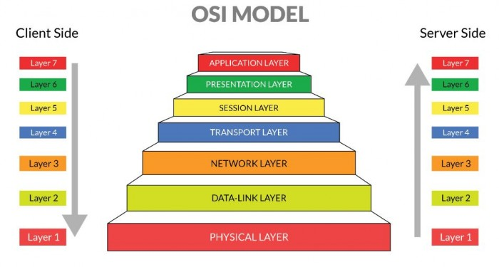

# 7 OSI Layer 🛰️

    Nama		: Moch. Irham Kafi Billah
    NRP		: 3122600009
    Kelas		: 2 D4 Teknik Informatika
    Mata Kuliah	: Konsep Jaringan
    Dosen Pengampu	: Dr. Ferry Astika Saputra ST, M.Sc

#

    

Model OSI (Open Systems Interconnection) adalah konsep yang dirancang oleh International Organization for Standardization (ISO) untuk memberikan struktur terorganisir bagi proses pertukaran data melalui jaringan. Awalnya, interaksi data antara komputer-komputer dari berbagai produsen menjadi rumit karena perbedaan protokol dan format data yang digunakan. Oleh karena itu, ISO menciptakan kerangka kerja komunikasi yang dikenal sebagai model OSI, yang menetapkan standar untuk mengintegrasikan komputer-komputer dari berbagai produsen.

## Fungsi dan penjelasan masing-masing layer

### 1. Application Layer (Lapisan ke-7)

Application layer adalah lapisan yang menjadi pusat (_center_) terjadinya suatu interaksi antara pengguna (_end user_) dengan aplikasi yang bekerja menggunakan fungsionalitas sebuah jaringan.
**Contoh**: HTTP, SMTP, FTP, NFS, dan lain-lain.

### 2. Presentation Layer (Lapisan ke-6)

Presentation layer mempunyai fungsi untuk mentranslasikan format data yang akan ditransmisikan oleh aplikasi melalui jaringan, ke dalam format yang dapat ditransmisikan oleh sebuah jaringan. Pada layer ini, data juga akan ter-enkripsi dan dekripsi melalui sistem.
**Contoh**: MIME, SSL, TLS, Redirector Software (contohnya Windows NT, Network Shell, atau Remote Desktop Protocol (RDP)), dan lain sebagainya.

### 3. Session Layer (Lapisan ke-5)

Session layer merupakan lapisan yang berfungsi untuk mendefinisikan bagaimana sebuah koneksi dapat dibuat, dikelola, dan dikembangkan.
**Contoh**: NFS, SMB, RTP, dan lain-lain.

### 4. Transport Layer (Lapisan ke-4)

Transport layer mempunyai fungsi untuk memecah data menjadi paket-paket data, serta memberikan nomor urut untuk setiap paketnya. Sehingga, nantinya dapat disusun kembali saat sampai pada tujuan.
**Contoh**: TCP (Transmission Control Protocol), UDP (User Datagram Protocol).

### 5. Network Layer (Lapisan ke-3)

Network layer mempunyai fungsi untuk membuat _header_ untuk paket yang berisi informasi IP (_Internet Protocol_), baik IP pengirim atau IP tujuan data. Pada suatu kondisi, network _layer_ juga melakukan proses _routing_ melalui _internetworking_ dengan menggunakan bantuan router dan switch pada _layer_ ke-3.
**Contoh**: IP (Internet Protocol), ICMP (Internet Control Message Protocol).

### 6. Data-Link Layer (Lapisan ke-2)

Pada data-link layer memiliki tugas untuk menentukan setiap bit data dikelompokkan menjadi format yang disebut dengan frame.
**Contoh**: ARP (Address Resolution Protocol) dan RARP (Reverse Address Resolution Protocol).

### 7. Physical Layer (Lapisan ke-1)

Physical layer mempunyai fungsi untuk mendefinisikan media transmisi jaringan, sinkronisasi bit, metode pensinyalan, serta membangun arsitektur jaringan seperti Ethernet, pengkabelan, dan topologi jaringan.
**Contoh**: Kabel Ethernet, gelombang radio, tipe konektor (misalnya, RJ-45 untuk Ethernet).
