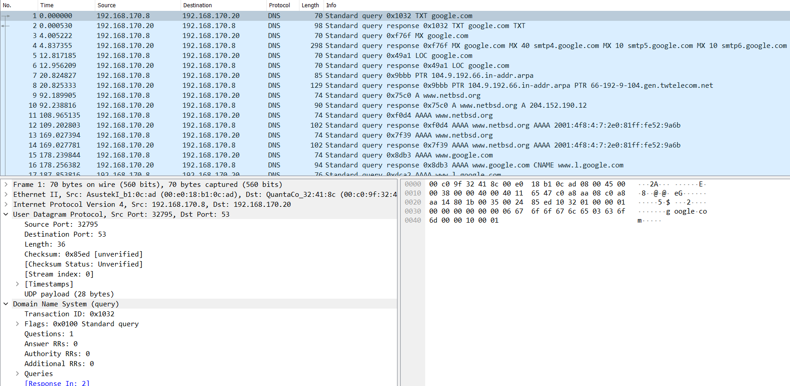

# Analisis HTTP, TELNET, dan DNS di Wireshark

    Nama		: Moch. Irham Kafi Billah
    NRP		: 3122600009
    Kelas		: 2 D4 Teknik Informatika
    Mata Kuliah	: Konsep Jaringan
    Dosen Pengampu	: Dr. Ferry Astika Saputra ST, M.Sc

#

## 1. http.cap

HTTP adalah singkatan dari "Hypertext Transfer Protocol". Ini adalah protokol yang digunakan untuk mengirimkan data antara klien (seperti peramban web) dan server di World Wide Web. HTTP digunakan untuk mengatur cara permintaan dan respon data, terutama dalam konteks halaman web, tetapi juga digunakan dalam berbagai aplikasi berbasis web.

    
    
<strong>Gambar:</strong> http.cap

- analisis
  Metode: GET. Ini menunjukkan bahwa permintaan ini adalah permintaan untuk mengambil (mendownload) halaman atau konten yang diberikan.
  Path: /download.html. Ini adalah bagian dari URL yang menunjukkan alamat spesifik yang diminta.
  Versi HTTP: HTTP/1.1. Versi protokol HTTP yang digunakan.
  Host: www.ethereal.com. Ini adalah header yang menunjukkan domain yang diminta.
  Status: 200 OK. Kode status yang menunjukkan bahwa permintaan berhasil.
  Date: Tanggal dan waktu respons dihasilkan.

Permintaan HTTP, seperti saat Anda mengakses URL melalui browser, dibuat dalam format yang disebut "HTTP request." Permintaan ini berisi informasi seperti metode (GET, POST, dll.), alamat URL, header, dan jika diperlukan, data tubuh (body) seperti data formulir.

Respons HTTP, yang berisi data yang diminta oleh permintaan, juga dibentuk dalam format yang disebut "HTTP response." Respons ini berisi informasi seperti kode status (misalnya 200 OK, 404 Not Found), header, dan konten aktual yang diminta.

## 2. telnet-cooked.pcap

Telnet adalah sebuah protokol jaringan yang digunakan untuk mengakses dan mengendalikan perangkat jarak jauh melalui jaringan. Biasanya, Telnet digunakan untuk mengakses shell atau lingkungan baris perintah pada perangkat jarak jauh seperti server, router, atau perangkat lainnya yang memiliki kemampuan koneksi jaringan.

    
    
<strong>Gambar:</strong> telnet-cooked.pcap

- analisis
  login: fake: Dalam contoh ini, "fake" adalah nama pengguna yang dimasukkan.
  Password: user: Kata sandi yang dimasukkan adalah "user". Ini adalah contoh kata sandi yang dimasukkan oleh pengguna.
  $ /sbin/ping www.yahoo.com: Ini adalah perintah untuk menjalankan tes "ping" ke alamat IP 204.71.200.67, yang dihubungkan dengan nama domain www.yahoo.com.

Telnet membantu memfasilitasi interaksi antara pengguna (melalui terminal atau program Telnet) dan perangkat jarak jauh (server atau perangkat lain). Protokol Telnet mengatur cara pesan dikirimkan antara klien (program Telnet) dan server, serta bagaimana respons dari perangkat jarak jauh diterima dan ditampilkan ke pengguna.

## 3. dns.cap

Protokol DNS (Domain Name System) adalah protokol yang digunakan untuk menerjemahkan nama domain yang mudah diingat menjadi alamat IP numerik yang diperlukan oleh komputer untuk mengidentifikasi dan berkomunikasi satu sama lain dalam jaringan.

    
    
<strong>Gambar:</strong> dns.cap

- analisis
  "source" atau sumber adalah komputer atau perangkat yang menginisiasi permintaan DNS. Ini biasanya adalah komputer tempat aplikasi, seperti peramban web, berjalan. Sumber mengirimkan permintaan DNS ke server DNS untuk mencari tahu alamat IP yang sesuai dengan nama domain yang dimasukkan.
  "destination" atau tujuan adalah server DNS yang menerima permintaan DNS dari sumber. Server DNS ini bertugas untuk mencari informasi yang diperlukan dalam database DNS atau meneruskan permintaan ke server lain jika informasi tersebut tidak ada di dalamnya.
