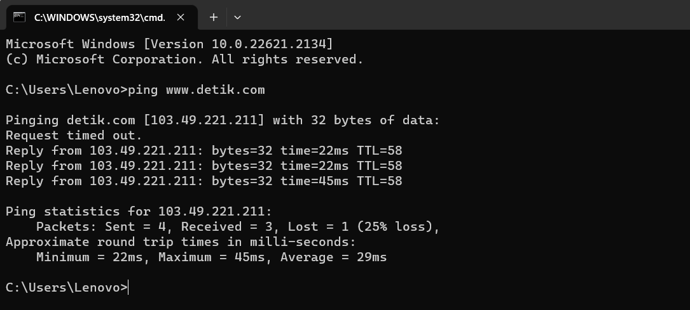
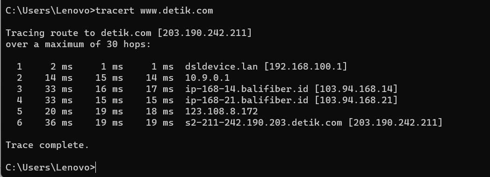

# Test Ping dan Tracerout di Command Prompt

    Nama		: Moch. Irham Kafi Billah
    NRP		: 3122600009
    Kelas		: 2 D4 Teknik Informatika
    Mata Kuliah	: Konsep Jaringan
    Dosen Pengampu	: Dr. Ferry Astika Saputra ST, M.Sc

#

## 1. Ping

Perintah ping bekerja dengan cara mengirim paket ke alamat yang ditentukan, pengirim paket menunggu balasan dari alamat tersebut. Perjalanan paket dari mulai dikirim dan balik lagi ke pengirim memerlukan waktu. Makin cepat paket kembali ke pengirim, maka makin bagus koneksi antara pengirim dan tujuan. Bila melakukan ping ke 2 alamat tujuan yang berbeda dengan memakai jaringan yang sama, bisa disimpulkan letak server dari 2 alamat tujuan tersebut.

    

Berikut adalah elemen-elemen utama yang Anda lihat saat menjalankan tes ping di cmd:

1. Paket Data: Setiap kali Anda menjalankan tes ping, cmd mengirimkan serangkaian paket data ke alamat tujuan yang Anda tentukan. Paket data ini berisi informasi yang diperlukan untuk mengukur respons dari alamat tersebut.

2. Waktu (Time): Salah satu elemen yang paling penting dalam hasil ping adalah waktu (time) yang diperlukan untuk setiap paket data untuk pergi ke alamat tujuan dan kembali lagi ke komputer Anda. Ini diukur dalam milisecond (ms) dan menunjukkan berapa lama perjalanan pulang-pergi paket data tersebut.

3. TTL (Time To Live): TTL adalah nilai yang ditambahkan ke setiap paket data yang dikirim. Nilai ini menurun setiap kali paket data melewati perangkat jaringan seperti router. Jika TTL mencapai nol, paket data akan dibuang. Informasi TTL dapat memberikan gambaran tentang jumlah "langkah" atau router yang diperlukan untuk mencapai alamat tujuan.

4. Ukuran Paket: Ukuran paket data yang dikirimkan dalam tes ping dapat bervariasi. Biasanya, ukuran paket ping adalah 32 byte, tetapi ini dapat diubah sesuai preferensi atau kebutuhan pengguna.

5. Rute (Route): Hasil ping biasanya menampilkan rute yang diambil oleh paket data untuk mencapai tujuan. Ini adalah daftar alamat IP dari setiap perangkat jaringan yang dilalui paket data selama perjalanan.

6. Statistik: Setelah semua paket data telah dikirim dan diterima, cmd akan menampilkan statistik mengenai kecepatan, waktu minimum, waktu maksimum, dan rata-rata respons dari alamat tujuan.

7. Keterangan Kesalahan: Jika ada masalah dengan koneksi, Anda mungkin akan melihat keterangan kesalahan seperti "Request Timed Out" (Permintaan Waktu Habis), yang menunjukkan bahwa paket data tidak berhasil sampai ke tujuan dalam batas waktu yang ditentukan.

## 2. Traceroute

Traceroute (Tracert) adalah perintah untuk menunjukkan rute yang dilewati paket untuk mencapai tujuan. Ini dilakukan dengan mengirim pesan Internet Control Message Protocol (ICMP) Echo Request Ke tujuan dengan nilai Time to Live yang semakin meningkat. Rute yang ditampilkan adalah daftar interface router (yang paling dekat dengan host) yang terdapat pada jalur antara host dan tujuan.

    

Berikut adalah elemen-elemen utama yang Anda lihat saat menjalankan tes tracert di cmd:

1. Hop: Setiap langkah dalam perjalanan paket data dari komputer Anda ke alamat tujuan disebut sebagai "hop." Setiap hop mewakili perangkat jaringan seperti router yang ditemui oleh paket data dalam perjalanan menuju tujuan.

2. Waktu (Time): Seperti pada perintah "ping," waktu (time) di sini menunjukkan berapa lama dibutuhkan oleh setiap paket data untuk mencapai hop berikutnya. Ini diukur dalam milisecond (ms) dan menunjukkan latensi pada setiap hop.

3. Nama Host atau Alamat IP: Untuk setiap hop, Anda akan melihat nama host (jika tersedia) atau alamat IP perangkat jaringan yang ada di hop tersebut. Ini membantu Anda memahami jalur perjalanan data dan mengidentifikasi perangkat jaringan tertentu.

4. Hilang (Loss): Terkadang, paket data dapat hilang di salah satu hop, biasanya disebabkan oleh kelebihan lalu lintas, masalah jaringan, atau firewall yang memblokir respons. Anda akan melihat asterisk (\*) atau waktu yang lebih lama untuk mengindikasikan paket data yang hilang.

5. Jarak (TTL - Time To Live): Seperti pada perintah "ping," nilai TTL menunjukkan berapa banyak hop yang ditemui oleh paket data sebelum mencapai tujuan akhir atau sebelum TTL mencapai nol. Hal ini membantu Anda melihat seberapa banyak perangkat jaringan yang ditemui dalam perjalanan.

6. Statistik: Setelah semua hop telah dilacak, cmd akan menampilkan statistik mengenai waktu minimum, maksimum, dan rata-rata respons pada setiap hop.

7. Keterangan Kesalahan: Jika ada hop yang tidak merespons atau mengalami masalah, Anda mungkin akan melihat keterangan kesalahan seperti "Request Timed Out" (Permintaan Waktu Habis).
