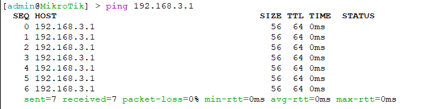

# MikroTik Winbox

    Nama		: Moch. Irham Kafi Billah
    NRP		: 3122600009
    Kelas		: 2 D4 Teknik Informatika
    Mata Kuliah	: Konsep Jaringan
    Dosen Pengampu	: Dr. Ferry Astika Saputra ST, M.Sc

Winbox adalah sebuah aplikasi berbasis windows yang biasa digunakan untuk konfigurasi mikrotik.

Mikrotik adalah sebuah OS atau perangkat lunak yang bisa digunakan untuk mengubah suatu perangkat komputer menjadi sebuah router jaringan.

## Konfigurasi

### 1. Masukkan MAC Address

    

### 2. Tampilan awal setelah login

    

### 3. Membuat Bridge baru

    

### 4. Tamabahkan ports yang dibutuhkan

    

 

    

### 5. Tamabahkan Address list

    

### 6. Tamabahkan routes yang dibutuhkan

    

### 5. Tes ping ke semua pc

    

    

    

    

    

    

    

    

    

    

