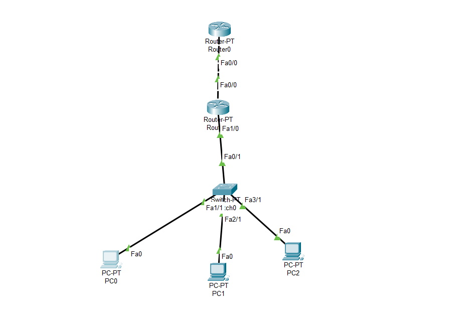

# Phsyical Design | MikroTik Winbox

    Nama		: Moch. Irham Kafi Billah
    NRP		: 3122600009
    Kelas		: 2 D4 Teknik Informatika
    Mata Kuliah	: Konsep Jaringan
    Dosen Pengampu	: Dr. Ferry Astika Saputra ST, M.Sc

**Konfigurasi** :

## **1. Router 0**

    -Static
    Network     : 192.168.5.0
    Mask        : 255.255.255.0
    Next Hop    : 10.252.108.15
    -Fe 0/0
    IPv4 Address: 10.252.108.5
    Subnet Mask : 255.0.0.0

## **2. Router 1**

    -Fe 0/0
    IPv4 Address: 10.252.108.15
    Subnet Mask : 255.0.0.0
    -Fe 1/0
    IPv4 Address: 192.168.5.1
    Subnet Mask : 255.255.255.0

## **3. PC 1**

    IPv4 Address    : 192.168.5.2
    Subnet Mask     : 255.255.255.0
    Default Gateway : 192.168.5.1

## **4. PC 2**

    IPv4 Address    : 192.168.5.3
    Subnet Mask     : 255.255.255.0
    Default Gateway : 192.168.5.1

## **5. PC 3**

    IPv4 Address    : 192.168.5.4
    Subnet Mask     : 255.255.255.0
    Default Gateway : 192.168.5.1
