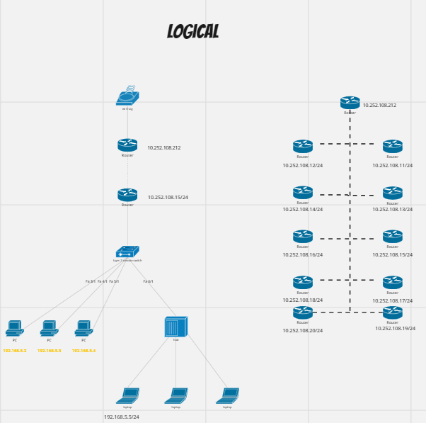
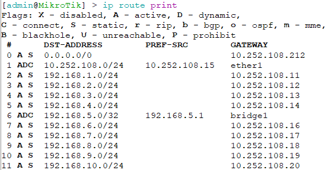

    Nama		: Moch. Irham Kafi Billah
    NRP		: 3122600009
    Kelas		: 2 D4 Teknik Informatika
    Mata Kuliah	: Konsep Jaringan
    Dosen Pengampu	: Dr. Ferry Astika Saputra ST, M.Sc
    
## **1. Ping antara PC**

## **2. Physical**

## **3. Logical**

## **4. Printing route table**

- ADC: Merujuk kepada route yang ditambahkan secara otomatis karena interface yang aktif.
- AS: Merujuk kepada route yang ditambahkan secara manual atau secara statis.
- etherl: Mengacu pada interface fisik yang terhubung ke subnet tertentu.
- bridgel: Mengacu pada bridge yang digunakan dalam konfigurasi jaringan Anda.

Angka 1 dalam kolom `DISTANCE` mungkin mengacu pada jarak administratif. Jarak administratif adalah metrik yang digunakan dalam protokol routing untuk menentukan prioritas rute. Semakin kecil angka jarak administratif, semakin tinggi prioritas rute tersebut.

Pesan seperti "connect," "s static," "r rip," "b- bgp," "o ospf," "m blackhole," "U unreachable," dan "P prohibit" yang Anda sebutkan mungkin adalah penjelasan status atau jenis rute:

- "connect" mungkin merujuk pada rute yang terhubung secara langsung.
- "s static" mengacu pada rute statis yang ditambahkan secara manual.
- "r rip" mungkin merujuk pada rute yang diperoleh melalui protokol RIP (Routing Information Protocol).
- "b- bgp" mungkin merujuk pada rute yang diperoleh melalui protokol BGP (Border Gateway Protocol).
- "o ospf" mungkin merujuk pada rute yang diperoleh melalui protokol OSPF (Open Shortest Path First).
- "m blackhole" mungkin merujuk pada rute yang digunakan untuk mengarahkan lalu lintas ke "blackhole" atau mengabaikan lalu lintas tersebut.
- "U unreachable" mungkin merujuk pada rute yang menuju ke tujuan yang tidak dapat dicapai.
- "P prohibit" mungkin merujuk pada rute yang melarang lalu lintas ke tujuan tertentu.