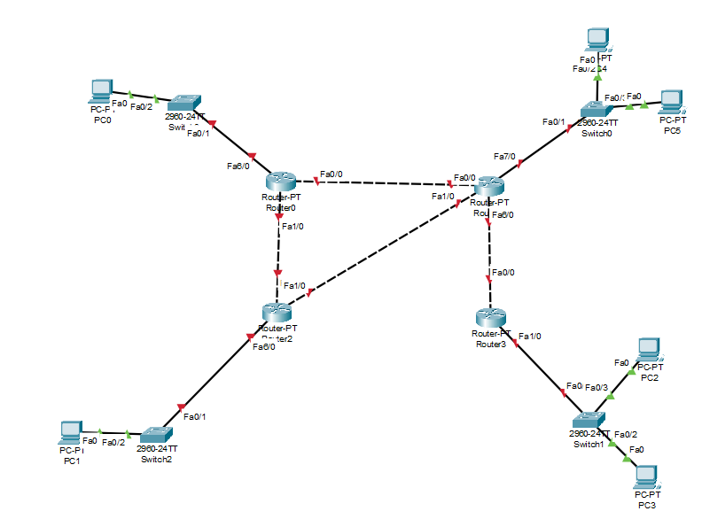

    Nama		: Moch. Irham Kafi Billah
    NRP		: 3122600009
    Kelas		: 2 D4 Teknik Informatika
    Mata Kuliah	: Konsep Jaringan
    Dosen Pengampu	: Dr. Ferry Astika Saputra ST, M.Sc

Configurasi :

## **1. Router 0**
    - Static
        - Network     : 192.168.1.0
          Next Hop    : 192.168.10.14
        - Network     : 192.168.3.0
          Next Hop    : 192.168.10.9
    - Fe 0/0
        IPv4 Address: 192.168.10.13
        Subnet Mask : 255.255.255.252

## **2. Router 1**
 - Static
        - Network     : 192.168.4.0
          Next Hop    : 192.168.10.13
        - Network     : 192.168.2.0
          Next Hop    : 192.168.10.1
        - Network     : 192.168.3.0
          Next Hop    : 192.168.10.6
    - Fe 0/0
        IPv4 Address: 192.168.10.14
        Subnet Mask : 255.255.255.252

## **2. Router 2**
 - Static
        - Network     : 192.168.4.0
          Next Hop    : 192.168.10.10
        - Network     : 192.168.1.0
          Next Hop    : 192.168.10.5
    - Fe 0/0
        IPv4 Address: 192.168.10.9
        Subnet Mask : 255.255.255.252

## **2. Router 3**
    - Static
        - Network     : 192.168.1.0
          Next Hop    : 192.168.10.2
    - Fe 0/0
        IPv4 Address: 192.168.10.1
        Subnet Mask : 255.255.255.252