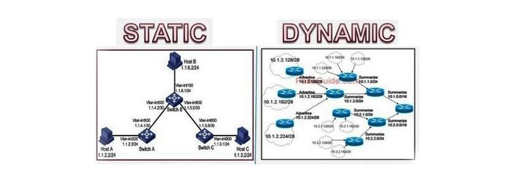

    
    Nama		: Moch. Irham Kafi Billah
    NRP		: 3122600009
    Kelas		: 2 D4 Teknik Informatika
    Mata Kuliah	: Konsep Jaringan
    Dosen Pengampu	: Dr. Ferry Astika Saputra ST, M.Sc

   <a>Dinamis Routing dalam Jaringan Komputer</a>

## A.Pendahuluan

Jaringan komputer adalah komponen penting dalam dunia digital saat ini, menghubungkan jutaan perangkat dan pengguna di seluruh dunia. Untuk menjaga komunikasi yang efisien dan efektif, dinamika dalam jaringan perlu dipahami dan dikelola. Salah satu aspek penting dalam pengelolaan jaringan adalah routing, yang mengatur bagaimana data dikirimkan dari satu perangkat ke perangkat lain. Dinamis routing adalah salah satu pendekatan yang digunakan dalam pengelolaan jaringan modern. Dalam esai ini, kami akan membahas konsep dinamis routing, manfaatnya, dan beberapa teknologi terkait.

## B.Konsep Dasar

Statis routing adalah metode di mana administrator jaringan secara manual menentukan rute data yang digunakan dalam jaringan. Ini berbeda dengan dinamis routing, di mana protokol routing menghitung rute secara otomatis berdasarkan informasi topologi jaringan. Dalam statis routing, administrator secara eksplisit mengonfigurasi tabel routing pada perangkat jaringan untuk mengarahkan data ke tujuan yang diinginkan. Ini sering digunakan dalam jaringan yang memiliki topologi sederhana atau ketika perubahan jarang terjadi.Dinamis routing adalah metode routing di mana rute data dalam jaringan dapat berubah secara otomatis sesuai dengan perubahan topologi jaringan atau keadaan jaringan. Ini berbeda dengan metode routing statis di mana rute ditentukan dan diatur secara manual. Dalam dinamis routing, protokol routing digunakan untuk mengumpulkan informasi tentang topologi jaringan dan memutuskan rute terbaik berdasarkan informasi tersebut. Dua protokol routing yang umum digunakan adalah Routing Information Protocol (RIP) dan Open Shortest Path First (OSPF).

## C.Manfatt Dinamis Routing
Penggunaan statis routing memiliki beberapa manfaat yang penting dalam pengelolaan jaringan:

1. Keprediktabilitas: Statis routing memungkinkan administrator untuk memiliki kendali penuh atas bagaimana data dikirimkan, sehingga rute data dapat diprediksi dengan baik.

2. Kinerja yang Konsisten: Dalam situasi di mana topologi jaringan stabil, statis routing dapat memberikan kinerja yang konsisten dan tidak membebani perangkat jaringan dengan perhitungan dinamis.

3. Keamanan: Karena administrator memiliki kendali penuh atas tabel routing, ini dapat membantu dalam mencegah pengalihan data yang tidak diinginkan.

## D.Manfaat Dinamis Routing

Dinamis routing menawarkan sejumlah manfaat yang penting dalam pengelolaan jaringan:

1. Skalabilitas: Dinamis routing memungkinkan jaringan untuk tumbuh dan berubah tanpa perlu intervensi manual. Ini sangat penting dalam jaringan yang besar dan kompleks.

2. Redundansi: Ketika ada perubahan dalam topologi jaringan atau kegagalan perangkat, dinamis routing dapat menemukan rute alternatif secara otomatis, menjaga kontinuitas layanan.

3. Optimalitas: Protokol dinamis routing mencari rute terbaik berdasarkan berbagai faktor, termasuk kecepatan, biaya, dan beban, sehingga dapat mengoptimalkan penggunaan sumber daya jaringan.

4. Manajemen Mudah: Dinamis routing memungkinkan administrator jaringan untuk mengelola jaringan dengan lebih mudah, menghindari perubahan manual yang rumit.

## E.Kesimpulan

Dinamis routing adalah konsep penting dalam pengelolaan jaringan komputer. Ini memungkinkan jaringan untuk beradaptasi dengan perubahan topologi dan memastikan pengiriman data yang efisien. Dengan menggunakan protokol routing yang sesuai, seperti RIP atau OSPF, administrator jaringan dapat memanfaatkan manfaat dinamis routing untuk mengoptimalkan kinerja jaringan mereka. Dalam dunia yang semakin terhubung, pemahaman yang mendalam tentang dinamis routing menjadi semakin penting dalam menjaga keandalan jaringan komputer.

## F.Referensi

Tanenbaum, A. S., & Wetherall, D. (2011). Computer Networks. Pearson.
Kurose, J. F., & Ross, K. W. (2017). Computer Networking: Principles, Protocols and Practice.
Perlman, R. (1985). An Overview of Routing in the Internet. IEEE/ACM Transactions on Networking.
Tanenbaum, A. S., & Wetherall, D. (2011). Computer Networks. Pearson.
Comer, D. E. (2017). Internetworking with TCP/IP, Vol. 1: Principles, Protocols, and Architecture. Pearson.
Halabi, S. (2000). Internet Routing Architectures. Cisco Press.