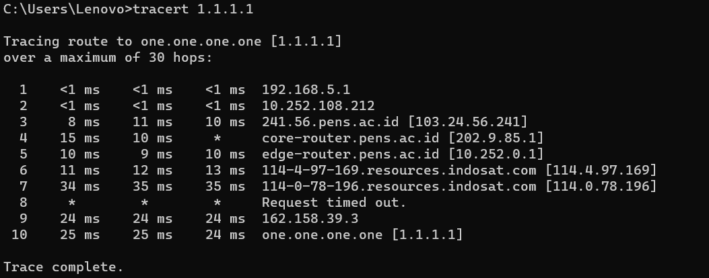
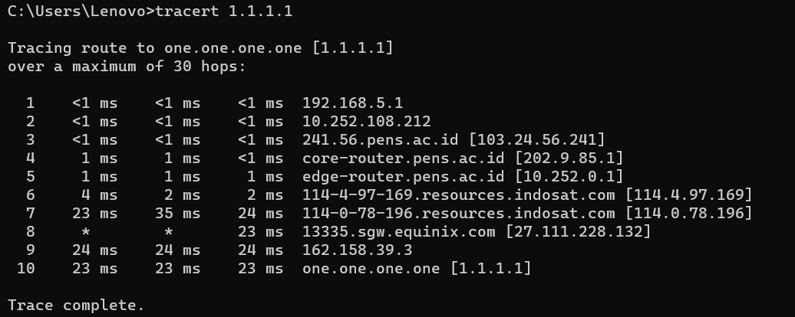
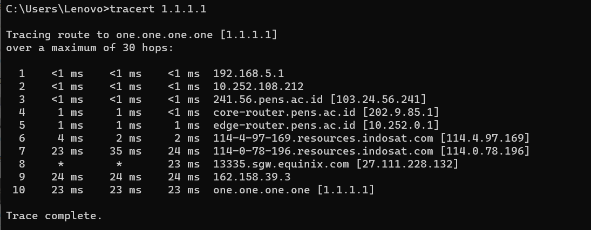
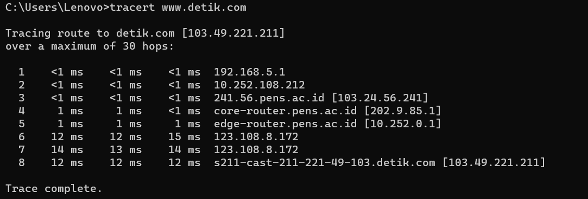
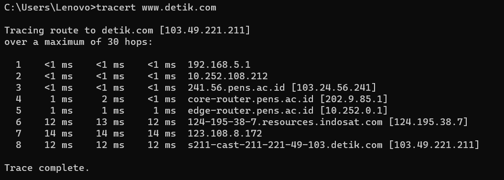
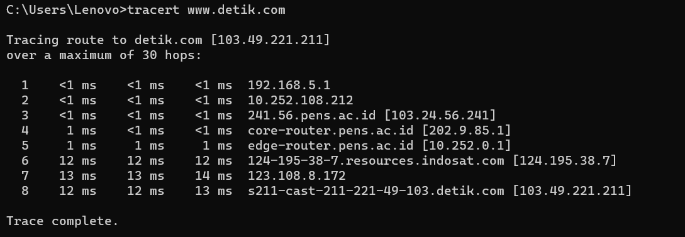

# Traceroute

    Nama		: Moch. Irham Kafi Billah
    NRP		: 3122600009
    Kelas		: 2 D4 Teknik Informatika
    Mata Kuliah	: Konsep Jaringan
    Dosen Pengampu	: Dr. Ferry Astika Saputra ST, M.Sc

Traceroute adalah salah satu cara pemecahan masalh jaringan yang berkerja dengan melacak rute jaringan dan menampilkannya di layar pengguna. Dengan begitu pengguna dapat memecahkan kendala jaringan serta melihat peringkat perantara mana saja yang telah menyebabkan masalah yang muncul.

Dasar cara kerjanya adalah ketika Anda terhubung pada situs web, maka ada paket yang berisi informasi yang dikirim bolak- balik di antara komputer dan server. Paket informasi ini telah melalui banyak perangkat lain atau hop selama perjalanannya menuju ke perangkat komputer atau server Anda. Jadi dengan alat traceroute ini Anda dapat melacak rute mana saja yang dilewati paket informasi dan dari sinilah Anda dapat menemukan penyebab masalah tadi.

## Traceroute ke 1.1.1.1

### Percobaan 1

    

Berikut adalah penjelasan untuk setiap hop atau lompatan dalam rute:

1. 192.168.5.1 - Hop pertama adalah router atau gateway lokal di jaringan Anda. Ini adalah langkah pertama dari jaringan lokal Anda untuk mencapai tujuan eksternal.

2. 10.252.108.212 - Hop kedua adalah alamat IP dari jaringan lokal Anda yang terhubung ke jaringan ISP (Penyedia Layanan Internet). Ini mungkin adalah router di jaringan ISP yang digunakan untuk mengarahkan lalu lintas ke luar.

3. 103.24.56.241 - Ini adalah hop ketiga, yang tampaknya merupakan bagian dari jaringan institusi (mungkin sebuah universitas) dengan alamat IP 241.56.pens.ac.id [103.24.56.241]. Ini adalah lompatan menuju jaringan yang lebih luas di luar jaringan ISP.

4. 202.9.85.1 - Hop keempat sepertinya adalah core router di dalam jaringan institusi (dari nama core-router.pens.ac.id). Alamat IP ini menunjukkan langkah internal di jaringan institusi sebelum mencapai router eksternal.

5. 10.252.0.1 - Hop kelima terlihat sebagai router pinggiran (edge router) dalam jaringan institusi. Ini adalah langkah terakhir sebelum paket data meninggalkan jaringan institusi tersebut.

6. 114.4.97.169 - Hop keenam adalah alamat yang dikaitkan dengan sumber daya (resources) di Indosat, sebuah penyedia layanan internet besar di Indonesia.

7. 114.0.78.196 - Langkah ketujuh juga terkait dengan sumber daya di Indosat, mungkin sebuah node dalam infrastruktur jaringan mereka.

8. Request timed out - Pada langkah ini, ada timeout saat mencoba menjangkau titik selanjutnya dalam rute. Ini bisa disebabkan oleh konfigurasi firewall atau router yang tidak merespons permintaan traceroute.

9. 162.158.39.3 - Langkah ini menunjukkan bahwa data telah mencapai jaringan Cloudflare. Cloudflare adalah perusahaan layanan CDN (Content Delivery Network) yang memiliki layanan DNS publik, salah satunya adalah 1.1.1.1 yang merupakan layanan DNS mereka.

10. 1.1.1.1 - Ini adalah tujuan akhir dari perjalanan traceroute, yaitu DNS resolver milik Cloudflare (1.1.1.1).

### Percobaan 2

    

Berikut adalah penjelasan untuk setiap hop atau lompatan dalam rute:

1. 192.168.5.1 - Ini adalah alamat IP dari router atau gateway di jaringan lokal Anda. Langkah pertama dalam proses mengirim paket data ke tujuan eksternal.

2. 10.252.108.212 - Hop kedua adalah alamat IP lain dari jaringan lokal Anda yang terhubung ke jaringan ISP (Penyedia Layanan Internet). Ini mungkin adalah router di jaringan ISP yang digunakan untuk mengarahkan lalu lintas ke luar.

3. 103.24.56.241 - Hop ketiga menunjukkan alamat IP yang terkait dengan domain pens.ac.id, mungkin sebuah institusi seperti universitas. Ini adalah langkah pertama keluar dari jaringan ISP dan masuk ke jaringan institusi.

4. 202.9.85.1 - Ini adalah alamat IP dari core router di dalam jaringan institusi (dari nama core-router.pens.ac.id). Ini adalah langkah internal di jaringan institusi sebelum mencapai router eksternal.

5. 10.252.0.1 - Hop kelima terlihat sebagai router pinggiran (edge router) dalam jaringan institusi. Ini adalah langkah terakhir sebelum paket data meninggalkan jaringan institusi tersebut.

6. 114.4.97.169 - Hop keenam adalah alamat yang dikaitkan dengan sumber daya (resources) di Indosat, sebuah penyedia layanan internet besar di Indonesia.

7. 114.0.78.196 - Langkah ketujuh juga terkait dengan sumber daya di Indosat, mungkin sebuah node dalam infrastruktur jaringan mereka.

8. 27.111.228.132 - Alamat ini menunjukkan bahwa paket data telah mencapai lokasi Equinix di Singapura (sgw.equinix.com). Equinix adalah penyedia layanan kolokasi dan interkoneksi yang besar.

9. 162.158.39.3 - Hop ini menunjukkan bahwa data telah mencapai jaringan Cloudflare. Cloudflare adalah perusahaan layanan CDN (Content Delivery Network) yang memiliki layanan DNS publik, salah satunya adalah 1.1.1.1 yang merupakan layanan DNS mereka.

10. 1.1.1.1 - Ini adalah tujuan akhir dari perjalanan traceroute, yaitu DNS resolver milik Cloudflare (1.1.1.1).

### Percobaan 3

    

Berikut adalah penjelasan untuk setiap hop atau lompatan dalam rute:

1. 192.168.5.1 - Ini adalah alamat IP dari router atau gateway di jaringan lokal Anda. Langkah pertama dalam proses mengirim paket data ke tujuan eksternal.

2. 10.252.108.212 - Hop kedua adalah alamat IP lain dari jaringan lokal Anda yang terhubung ke jaringan ISP (Penyedia Layanan Internet). Ini mungkin adalah router di jaringan ISP yang digunakan untuk mengarahkan lalu lintas ke luar.

3. 103.24.56.241 - Hop ketiga menunjukkan alamat IP yang terkait dengan domain pens.ac.id, mungkin sebuah institusi seperti universitas. Ini adalah langkah pertama keluar dari jaringan ISP dan masuk ke jaringan institusi.

4. 202.9.85.1 - Ini adalah alamat IP dari core router di dalam jaringan institusi (dari nama core-router.pens.ac.id). Ini adalah langkah internal di jaringan institusi sebelum mencapai router eksternal.

5. 10.252.0.1 - Hop kelima terlihat sebagai router pinggiran (edge router) dalam jaringan institusi. Ini adalah langkah terakhir sebelum paket data meninggalkan jaringan institusi tersebut.

6. 114.4.97.169 - Hop keenam adalah alamat yang dikaitkan dengan sumber daya (resources) di Indosat, sebuah penyedia layanan internet besar di Indonesia.

7. 114.0.78.196 - Langkah ketujuh juga terkait dengan sumber daya di Indosat, mungkin sebuah node dalam infrastruktur jaringan mereka.

8. 27.111.228.132 - Alamat ini menunjukkan bahwa paket data telah mencapai lokasi Equinix di Singapura (sgw.equinix.com). Equinix adalah penyedia layanan kolokasi dan interkoneksi yang besar.

9. 162.158.39.3 - Hop ini menunjukkan bahwa data telah mencapai jaringan Cloudflare. Cloudflare adalah perusahaan layanan CDN (Content Delivery Network) yang memiliki layanan DNS publik, salah satunya adalah 1.1.1.1 yang merupakan layanan DNS mereka.

10. 1.1.1.1 - Ini adalah tujuan akhir dari perjalanan traceroute, yaitu DNS resolver milik Cloudflare (1.1.1.1).

## Traceroute ke www.detik.com

### Percobaan 1

    

Berikut adalah penjelasan untuk setiap hop atau lompatan dalam rute:

1. 192.168.5.1 - Ini adalah alamat IP dari router atau gateway di jaringan lokal Anda. Ini merupakan langkah pertama dari jaringan lokal Anda menuju internet.

2. 10.252.108.212 - Hop kedua adalah alamat IP lain dari jaringan lokal Anda yang terhubung ke jaringan ISP (Penyedia Layanan Internet). Ini mungkin adalah router di jaringan ISP yang digunakan untuk mengarahkan lalu lintas ke luar.

3. 103.24.56.241 - Hop ketiga menunjukkan alamat IP yang terkait dengan domain pens.ac.id, mungkin sebuah institusi seperti universitas. Ini adalah langkah pertama keluar dari jaringan ISP dan masuk ke jaringan institusi.

4. 202.9.85.1 - Ini adalah alamat IP dari core router di dalam jaringan institusi (dari nama core-router.pens.ac.id). Ini adalah langkah internal di jaringan institusi sebelum mencapai router eksternal.

5. 10.252.0.1 - Hop kelima terlihat sebagai router pinggiran (edge router) dalam jaringan institusi. Ini adalah langkah terakhir sebelum paket data meninggalkan jaringan institusi tersebut.

6. 123.108.8.172 - Hop keenam adalah alamat IP yang merupakan bagian dari infrastruktur jaringan. Karena ada duplikasi alamat IP dalam langkah ini, kemungkinan adanya masalah pada konfigurasi atau penulisan alamat IP dalam output traceroute.

7. 123.108.8.172 - Seperti yang terlihat di langkah sebelumnya, ini adalah duplikasi dari alamat IP yang sama. Duplikasi alamat IP ini mungkin terjadi karena konfigurasi atau respons yang sama dari dua hop yang berbeda.

8. 103.49.221.211 - Ini adalah alamat IP akhir atau tujuan yang dituju, yaitu situs web detik.com. Alamat ini menunjukkan bahwa paket data telah mencapai server atau host dari detik.com.

### Percobaan 2

    

Berikut adalah penjelasan untuk setiap hop atau lompatan dalam rute:

1. 192.168.5.1 - Ini adalah alamat IP dari router atau gateway di jaringan lokal Anda. Ini merupakan langkah pertama dari jaringan lokal Anda menuju internet.

2. 10.252.108.212 - Hop kedua adalah alamat IP lain dari jaringan lokal Anda yang terhubung ke jaringan ISP (Penyedia Layanan Internet). Ini mungkin adalah router di jaringan ISP yang digunakan untuk mengarahkan lalu lintas ke luar.

3. 103.24.56.241 - Hop ketiga menunjukkan alamat IP yang terkait dengan domain pens.ac.id, kemungkinan sebuah institusi seperti universitas. Ini adalah langkah pertama keluar dari jaringan ISP dan masuk ke jaringan institusi.

4. 202.9.85.1 - Ini adalah alamat IP dari core router di dalam jaringan institusi (dari nama core-router.pens.ac.id). Ini adalah langkah internal di jaringan institusi sebelum mencapai router eksternal.

5. 10.252.0.1 - Hop kelima terlihat sebagai router pinggiran (edge router) dalam jaringan institusi. Ini adalah langkah terakhir sebelum paket data meninggalkan jaringan institusi tersebut.

6. 124.195.38.7 - Hop keenam adalah alamat IP yang terkait dengan sumber daya (resources) di Indosat, sebuah penyedia layanan internet besar di Indonesia.

7. 123.108.8.172 - Langkah ketujuh menunjukkan alamat IP dalam rute yang diketahui dalam jaringan menuju detik.com.

8. 103.49.221.211 - Ini adalah alamat IP akhir atau tujuan yang dituju, yaitu server detik.com. Alamat ini menunjukkan bahwa paket data telah mencapai server atau host dari detik.com.

### Percobaan 3

    

Berikut adalah penjelasan untuk setiap hop atau lompatan dalam rute:

1. 192.168.5.1 - Ini adalah alamat IP dari router atau gateway di jaringan lokal Anda. Ini merupakan langkah pertama dari jaringan lokal Anda menuju internet.

2. 10.252.108.212 - Hop kedua adalah alamat IP lain dari jaringan lokal Anda yang terhubung ke jaringan ISP (Penyedia Layanan Internet). Ini mungkin adalah router di jaringan ISP yang digunakan untuk mengarahkan lalu lintas ke luar.

3. 103.24.56.241 - Hop ketiga menunjukkan alamat IP yang terkait dengan domain pens.ac.id, kemungkinan sebuah institusi seperti universitas. Ini adalah langkah pertama keluar dari jaringan ISP dan masuk ke jaringan institusi.

4. 202.9.85.1 - Ini adalah alamat IP dari core router di dalam jaringan institusi (dari nama core-router.pens.ac.id). Ini adalah langkah internal di jaringan institusi sebelum mencapai router eksternal.

5. 10.252.0.1 - Hop kelima terlihat sebagai router pinggiran (edge router) dalam jaringan institusi. Ini adalah langkah terakhir sebelum paket data meninggalkan jaringan institusi tersebut.

6. 124.195.38.7 - Hop keenam adalah alamat IP yang terkait dengan sumber daya (resources) di Indosat, sebuah penyedia layanan internet besar di Indonesia.

7. 123.108.8.172 - Langkah ketujuh menunjukkan alamat IP dalam rute yang diketahui dalam jaringan menuju detik.com.

8. 103.49.221.211 - Ini adalah alamat IP akhir atau tujuan yang dituju, yaitu server detik.com. Alamat ini menunjukkan bahwa paket data telah mencapai server atau host dari detik.com.
