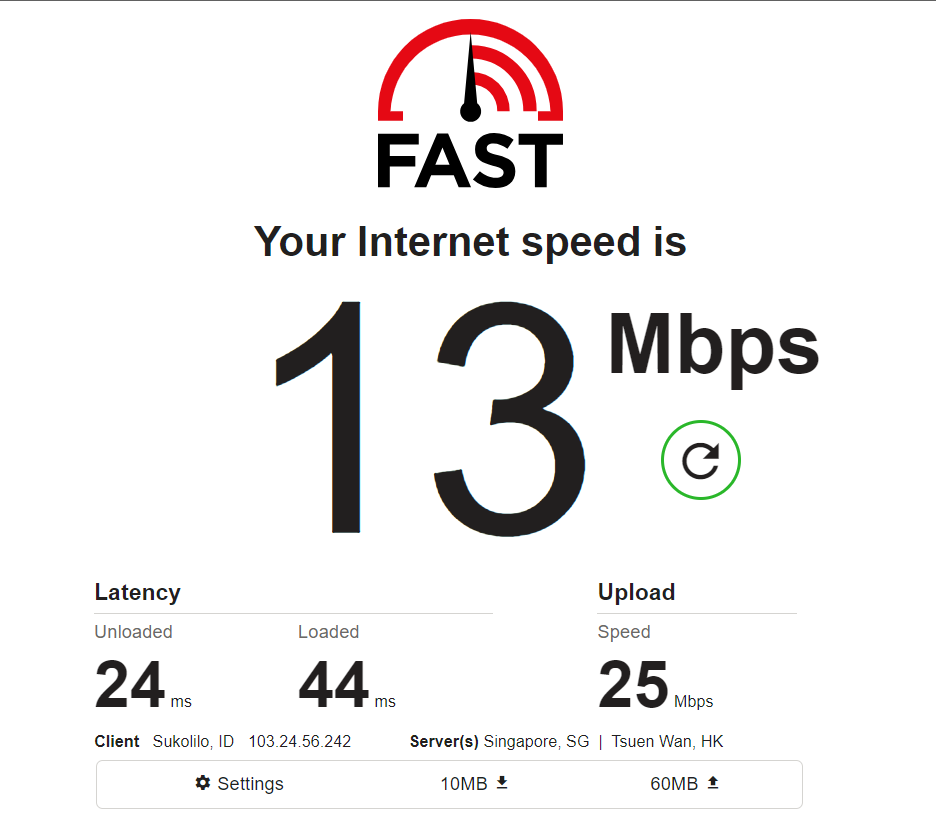
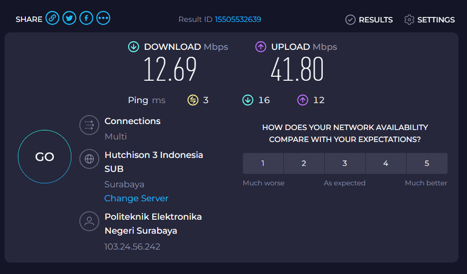

    
    Nama		: Moch. Irham Kafi Billah
    NRP		: 3122600009
    Kelas		: 2 D4 Teknik Informatika
    Mata Kuliah	: Konsep Jaringan
    Dosen Pengampu	: Dr. Ferry Astika Saputra ST, M.Sc

# BANDWIDTH TEST
## Test dari fast.com

## Test dari speedtest.net

## Test dari Mikrotik

