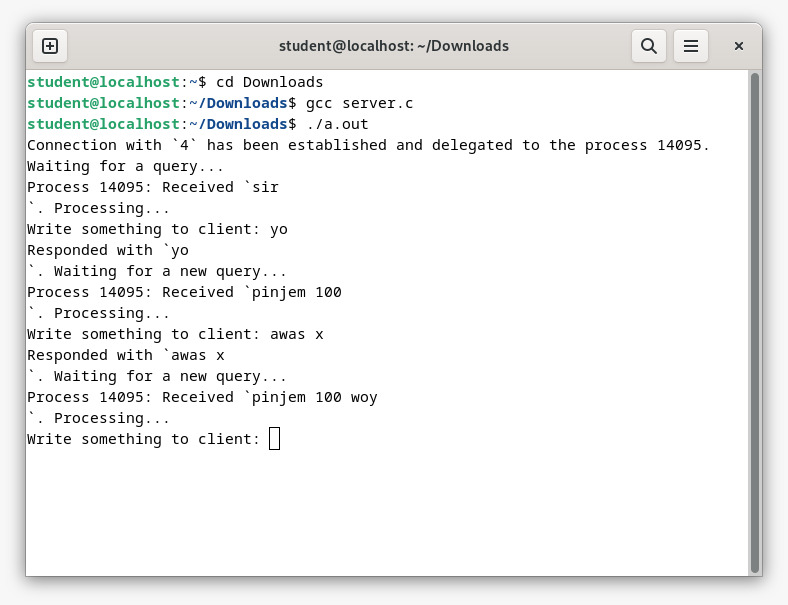
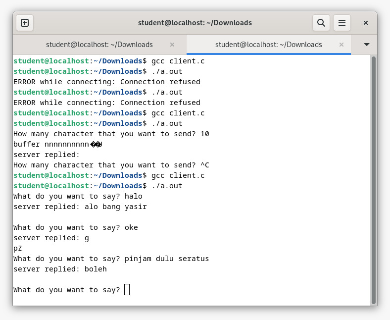

    
    Nama		: Moch. Irham Kafi Billah
    NRP		: 3122600009
    Kelas		: 2 D4 Teknik Informatika
    Mata Kuliah	: Konsep Jaringan
    Dosen Pengampu	: Dr. Ferry Astika Saputra ST, M.Sc

# Simple Server Client Response To Another Group
Simple Server-Client Using Socket Programming with C.

## Server

<div align="center">

</div>

## Client

<div align="center">

</div>

## Code

- client.c

```objectivec
portno = 10001;
...
// create socket and get file descriptor
sockfd = socket(AF_INET, SOCK_STREAM, 0);

server = gethostbyname("192.168.x.x");

if (server == NULL) {
    fprintf(stderr,"ERROR, no such host\n");
    exit(0);
}

```

Pastikan portno pada client.c sama persis seperti di server.c! dan juga pastikan server diubah menjadi IPv4 dari PC kelompok lain!

- server.c

```objectivec
int main( int argc, char *argv[] ) {
    const uint16_t port_number = 10001;
    ...
}
```

## Source

- client.c
```objectivec
#include <stdio.h>
#include <stdlib.h>

#include <netdb.h>
#include <netinet/in.h>

#include <string.h>
#include <unistd.h>

int main(int argc, char *argv[]) {
    int sockfd, portno, n;
    struct sockaddr_in serv_addr;

    struct hostent *server;

    char buffer[256];
    portno = 10001;

    // create socket and get file descriptor
    sockfd = socket(AF_INET, SOCK_STREAM, 0);

    server = gethostbyname("127.0.0.1");

    if (server == NULL) {
        fprintf(stderr,"ERROR, no such host\n");
        exit(0);
    }

    bzero((char *) &serv_addr, sizeof(serv_addr));
    serv_addr.sin_family = AF_INET;
    bcopy((char *)server->h_addr, (char *)&serv_addr.sin_addr.s_addr, server->h_length);
    serv_addr.sin_port = htons(portno);


    // connect to server with server address which is set above (serv_addr)

    if (connect(sockfd, (struct sockaddr *)&serv_addr, sizeof(serv_addr)) < 0) {
        perror("ERROR while connecting");
        exit(1);
    }

    // inside this while loop, implement communicating with read/write or send/recv function
    while (1) {
        printf("What do you want to say? ");
        bzero(buffer,256);
        fgets(buffer, 256, stdin);

        n = write(sockfd,buffer,strlen(buffer));

        if (n < 0){
            perror("ERROR while writing to socket");
            exit(1);
        }

        bzero(buffer,256);
        n = read(sockfd, buffer, 255);

        if (n < 0){
            perror("ERROR while reading from socket");
            exit(1);
        }
        printf("server replied: %s \n", buffer);

        // escape this loop, if the server sends message "quit"

        if (!bcmp(buffer, "quit", 4))
            break;
    }
    return 0;
}
```
  
- server.c
```objectivec
#include <stdio.h>
#include <stdlib.h>

#include <netdb.h>
#include <netinet/in.h>

#include <string.h>
#include <unistd.h>
#include <stdbool.h>
#include <time.h>

void bzero(void *a, size_t n) {
    memset(a, 0, n);
}

void bcopy(const void *src, void *dest, size_t n) {
    memmove(dest, src, n);
}

struct sockaddr_in* init_sockaddr_in(uint16_t port_number) {
    struct sockaddr_in *socket_address = malloc(sizeof(struct sockaddr_in));
    memset(socket_address, 0, sizeof(*socket_address));
    socket_address -> sin_family = AF_INET;
    socket_address -> sin_addr.s_addr = htonl(INADDR_ANY);
    socket_address -> sin_port = htons(port_number);
    return socket_address;
}

char* process_operation(char *input) {
    char text[256];
    printf("\nWrite something to client: ");
    fgets(text, 256, stdin);

    size_t n = strlen(text) * sizeof(char);
    char *output = malloc(n);
    memcpy(output, text, n);
    return output;
}

int main( int argc, char *argv[] ) {

    const uint16_t port_number = 10001;
    int server_fd = socket(AF_INET, SOCK_STREAM, 0);

    struct sockaddr_in *server_sockaddr = init_sockaddr_in(port_number);
    struct sockaddr_in *client_sockaddr = malloc(sizeof(struct sockaddr_in));
    socklen_t server_socklen = sizeof(*server_sockaddr);
    socklen_t client_socklen = sizeof(*client_sockaddr);


    if (bind(server_fd, (const struct sockaddr *) server_sockaddr, server_socklen) < 0)
    {
        printf("Error! Bind has failed\n");
        exit(0);
    }
    if (listen(server_fd, 3) < 0)
    {
        printf("Error! Can't listen\n");
        exit(0);
    }


    const size_t buffer_len = 256;
    char *buffer = malloc(buffer_len * sizeof(char));
    char *response = NULL;
    time_t last_operation;
    __pid_t pid = -1;

    while (1) {
        int client_fd = accept(server_fd, (struct sockaddr *) &client_sockaddr, &client_socklen);

        pid = fork();

        if (pid == 0) {
            close(server_fd);

            if (client_fd == -1) {
                exit(0);
            }

            printf("Connection with `%d` has been established and delegated to the process %d.\nWaiting for a query...\n", client_fd, getpid());

            last_operation = clock();

            while (1) {
                read(client_fd, buffer, buffer_len);

                if (buffer == "close") {
                    printf("Process %d: ", getpid());
                    close(client_fd);
                    printf("Closing session with `%d`. Bye!\n", client_fd);
                    break;
                }

                if (strlen(buffer) == 0) {
                    clock_t d = clock() - last_operation;
                    double dif = 1.0 * d / CLOCKS_PER_SEC;

                    if (dif > 5.0) {
                        printf("Process %d: ", getpid());
                        close(client_fd);
                        printf("Connection timed out after %.3lf seconds. ", dif);
                        printf("Closing session with `%d`. Bye!\n", client_fd);
                        break;
                    }

                    continue;
                }

                printf("Process %d: ", getpid());
                printf("Received `%s`. Processing... ", buffer);

                free(response);
                response = process_operation(buffer);
                bzero(buffer, buffer_len * sizeof(char));

                send(client_fd, response, strlen(response), 0);

                printf("Responded with `%s`. Waiting for a new query...\n", response);

                last_operation = clock();
            }
            exit(0);
        }
        else {
            close(client_fd);
        }
    }
}
```
