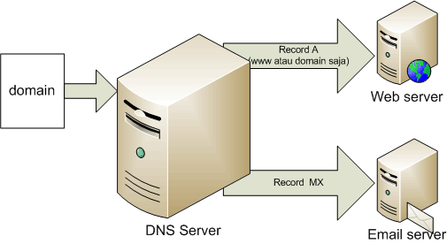

    Nama		: Moch. Irham Kafi Billah
    NRP		: 3122600009
    Kelas		: 2 D4 Teknik Informatika
    Mata Kuliah	: Konsep Jaringan
    Dosen Pengampu	: Dr. Ferry Astika Saputra ST, M.Sc

DNS (Domain Name System) adalah sistem yang menghubungkan nama domain yang mudah diingat (seperti www.example.com) dengan alamat IP komputer atau server tempat situs web tersebut di-hosting. Cara kerja DNS adalah sebagai berikut:

1. **Pemetaan Nama ke Alamat IP:** Ketika seseorang memasukkan nama domain (misalnya www.example.com) ke dalam peramban web, komputer client akan mencari alamat IP dari server DNS. Jika tidak ada informasi tentang alamat IP dalam cache lokal, permintaan akan dikirim ke server DNS.

2. **Resolusi DNS:** Server DNS kemudian melakukan proses resolusi, mencari alamat IP yang sesuai dengan nama domain yang diminta. Jika informasi itu tersedia, server DNS akan mengembalikan alamat IP ke komputer client.

3. **Pengiriman Permintaan:** Setelah mendapatkan alamat IP dari server DNS, komputer client akan menggunakan informasi tersebut untuk mengirim permintaan ke server yang diinginkan (misalnya, server web yang meng-host situs www.example.com).

4. **Pengembalian Data:** Server web yang dituju akan menerima permintaan, menemukan halaman yang diminta, dan mengirimkannya kembali ke komputer client melalui jaringan, yang kemudian akan ditampilkan dalam peramban web.

Email Server adalah server khusus yang bertanggung jawab untuk mengelola, menyimpan, dan mengirim email. Cara kerja email server melibatkan beberapa langkah:

1. **Penerimaan Email:** Ketika seseorang mengirim email, klien email seperti Outlook atau Gmail akan mengirim email ke server email penerima.

2. **Proses Pengiriman:** Email server penerima menerima email tersebut dan menyimpannya dalam antrian pengiriman. Server kemudian memeriksa alamat tujuan email untuk menentukan di mana email tersebut harus dikirim.

3. **Penyimpanan Email:** Jika alamat tujuan ditemukan pada server yang sama, email disimpan di dalam kotak surat elektronik (mailbox) pengguna tersebut di server. Jika tidak, server email akan mengirimkan email ke server tujuan menggunakan protokol komunikasi yang disepakati.

4. **Pengambilan Email:** Pengguna dapat mengakses emailnya dengan menggunakan klien email seperti Outlook, aplikasi mobile, atau webmail. Klien ini terhubung ke server email, mengirim permintaan untuk menampilkan atau mengunduh email dari kotak surat pengguna.

5. **Pengiriman Balasan:** Ketika pengguna menjawab email, klien email akan mengirim pesan balasan ke server email, yang kemudian akan mengirimnya kembali ke server email pengirim.

Baik DNS maupun email server memiliki peran kunci dalam menyediakan akses yang cepat dan andal terhadap situs web dan layanan email di internet.