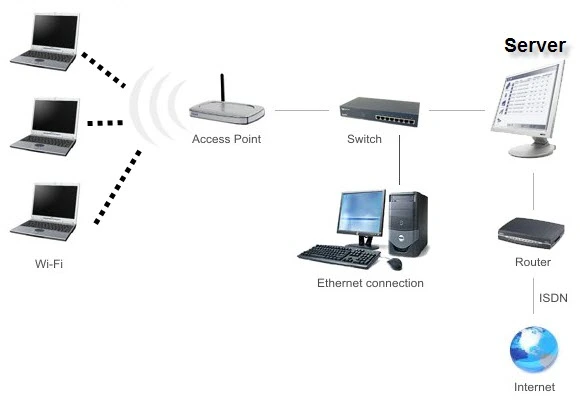

    Nama		: Moch. Irham Kafi Billah
    NRP		: 3122600009
    Kelas		: 2 D4 Teknik Informatika
    Mata Kuliah	: Konsep Jaringan
    Dosen Pengampu	: Dr. Ferry Astika Saputra ST, M.Sc

Salah satu arsitektur jaringan yang umum digunakan di banyak kampus adalah arsitektur jaringan nirkabel atau WLAN (Wireless Local Area Network). Arsitektur ini memungkinkan akses internet dan konektivitas antar perangkat secara nirkabel.

Contoh arsitektur jaringan nirkabel yang umum di kampus dapat menggambarkan struktur seperti ini:

Penjelasan tentang contoh arsitektur jaringan nirkabel di kampus:

1. **Access Point (AP)**: Merupakan perangkat yang digunakan untuk menyediakan akses nirkabel ke jaringan. Di kampus, terdapat beberapa AP yang ditempatkan di berbagai lokasi untuk menjangkau sebanyak mungkin area.

2. **Wireless Controller**: Bertanggung jawab mengelola dan mengatur kinerja jaringan nirkabel. Biasanya, wireless controller digunakan untuk mengelola beberapa access point secara sentral, memungkinkan administrasi yang lebih efisien.

3. **Backbone Network**: Merupakan infrastruktur utama yang menghubungkan semua access point dan menghubungkan jaringan nirkabel ke jaringan kabel yang lebih besar di kampus.

4. **Client Devices**: Merupakan perangkat-perangkat seperti laptop, smartphone, tablet, dan perangkat lainnya yang terhubung ke jaringan nirkabel untuk akses internet dan layanan jaringan lainnya.

5. **Internet Connection**: Merupakan sumber daya utama yang menghubungkan jaringan kampus ke internet.

Arsitektur jaringan nirkabel di kampus memungkinkan mobilitas tinggi bagi pengguna, memungkinkan mereka terhubung ke jaringan dari berbagai lokasi di area kampus tanpa keterbatasan kabel. Hal ini memudahkan akses internet dan layanan jaringan bagi mahasiswa, staf, dan pengunjung kampus.

Namun, penting untuk dicatat bahwa arsitektur jaringan kampus dapat bervariasi tergantung pada kebutuhan spesifik dan infrastruktur yang tersedia di setiap kampus.