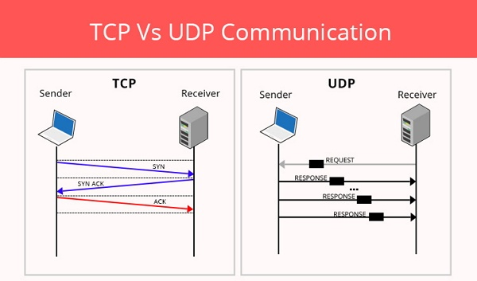

# Kenapa 1 Port FTP Bisa Menggunakan TCP ataupun UDP?

    Nama		: Moch. Irham Kafi Billah
    NRP		: 3122600009
    Kelas		: 2 D4 Teknik Informatika
    Mata Kuliah	: Konsep Jaringan
    Dosen Pengampu	: Dr. Ferry Astika Saputra ST, M.Sc

#

    
    
<strong>Gambar:</strong> TCP & UDP

FTP (File Transfer Protocol) umumnya menggunakan TCP (Transmission Control Protocol) karena TCP menjamin pengiriman data yang aman dan tepat waktu. Namun, ada beberapa kasus di mana FTP dapat menggunakan UDP (User Datagram Protocol) untuk beberapa tujuan tertentu, meskipun ini lebih jarang terjadi.

Biasanya, FTP menggunakan TCP karena itu memastikan bahwa data yang dikirimkan tiba dengan benar dan dalam urutan yang tepat. Ini sangat penting saat mentransfer file besar atau kritis. Di sisi lain, UDP lebih cocok untuk aplikasi yang membutuhkan kecepatan lebih tinggi dan tidak terlalu khawatir tentang pengiriman data yang sempurna.

Penggunaan UDP dalam FTP bisa terjadi dalam skenario khusus, seperti dalam varian FTP yang lebih modern atau modifikasi tertentu. Beberapa implementasi FTP menggunakan UDP untuk mengontrol koneksi atau bahkan koneksi data dalam beberapa kasus. Namun, perlu diingat bahwa penggunaan UDP ini lebih langka dan biasanya memerlukan penyesuaian khusus dalam konfigurasi atau implementasi FTP
