# TUGAS PRAKTIKUM | MINGGU 2

    Nama		: Moch. Irham Kafi Billah
    NRP		: 3122600009
    Kelas		: 2 D4 Teknik Informatika
    Mata Kuliah	: Konsep Jaringan
    Dosen Pengampu	: Dr. Ferry Astika Saputra ST, M.Sc

#

## Tugas 1. Analisis Flow Graph

    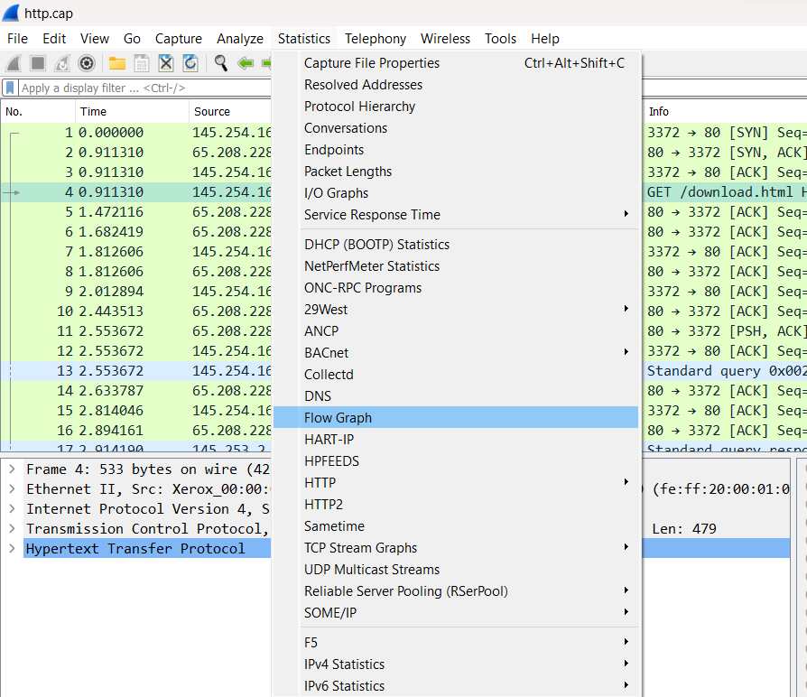
    
<strong>Gambar:</strong> Lokasi flow graph

Flow graph merupakan diagram alur yang menggambarkan komunikasi TCP (Transmission Control Protocol) dari alamat IP 145.254.160.237 (sumber) ke alamat IP 216.239.59.99 (tujuan), dengan nomor port 3372 (sumber) dan 80 (tujuan).

    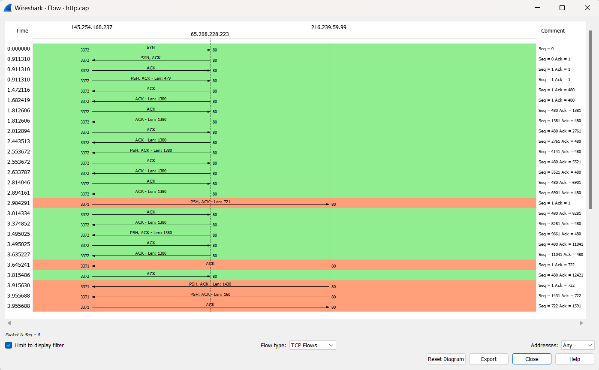
    
<strong>Gambar:</strong> Flow graph bagian 1

    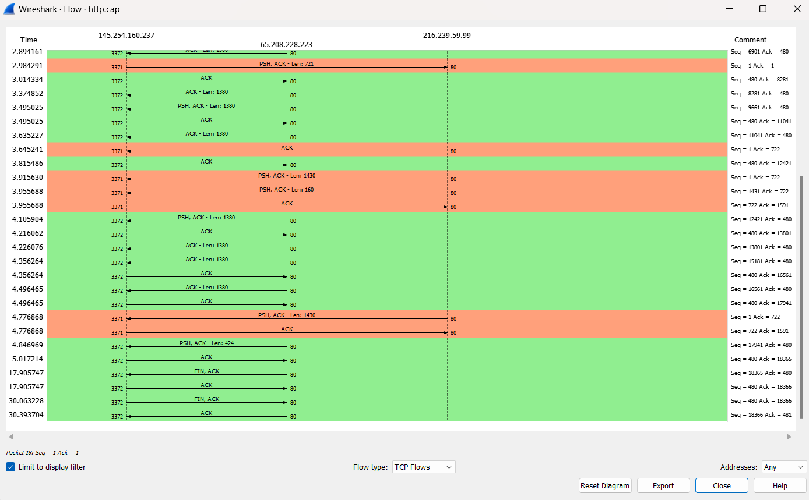
    
<strong>Gambar:</strong> Flow graph bagian 2

#### a. Inisialisasi:

    - Waktu: 0,000000
    - Sumber mengirimkan paket SYN ke tujuan (Seq = 0).
    - Tujuan merespon dengan paket SYN, ACK (Seq = 0, Ack = 1).
    - Sumber mengakui SYN, ACK dengan paket ACK (Seq = 1, Ack = 1).
    - Sumber mengirimkan paket PSH, ACK dengan panjang data 479 (Seq = 1, Ack = 1).

#### b. Pertukaran Data:

    - Paket data dipertukarkan dengan meningkatnya nomor urut dan nilai ACK.
    - Beberapa paket PSH, ACK dengan panjang bervariasi dikirim oleh sumber dan diakui oleh tujuan.
    - Nomor urut dan pengakuan terus bertambah pada setiap pertukaran.

#### c. Pemutusan Koneksi:

    - Paket FIN, ACK dikirim dari sumber ke tujuan untuk memulai proses penghentian koneksi (Seq = 18365, Ack = 480).
    - Tujuan mengetahui paket FIN, ACK (Seq = 480, Ack = 18366).
    - Paket FIN, ACK lainnya dikirim dari sumber ke tujuan (Seq = 480, Ack = 18366).
    - Tujuan menerima paket FIN, ACK kedua (Seq = 18366, Ack = 481)

## Tugas 2. Analisis Paket Counter

    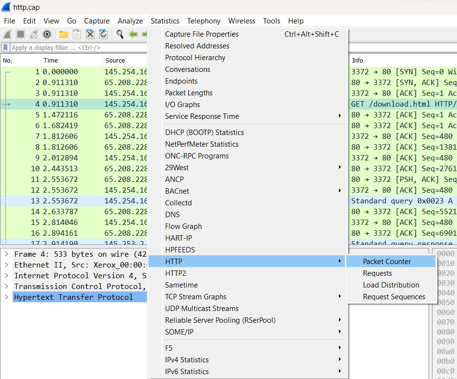
    
<strong>Gambar:</strong> Lokasi paket counter

    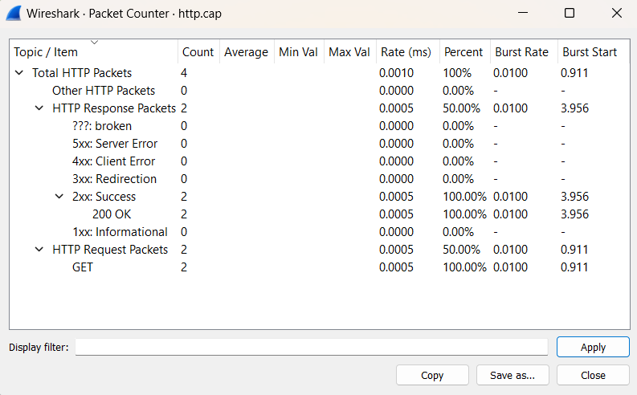
    
<strong>Gambar:</strong> Paket counter

Packet Counter merupakan alat yang membantu memahami apa yang sedang terjadi di jaringan internet dengan menghitung dan menampilkan paket atau frame dalam sebuah capture atau sesi pemantauan jaringan.
Adapun informasi penting terkait lalu lintas jaringan yang diberikan yaitu jumlah total packet, laju masuk paket, distribusi paket, burst rate, waktu awal burst.

1. Total HTTP Packets: Jumlah total paket HTTP yang terdeteksi oleh Wireshark.
2. Average: Rata-rata jumlah paket HTTP yang terdeteksi dalam satu detik.
3. Min Val: Jumlah minimum paket HTTP yang terdeteksi dalam satu detik.
4. Max Val: Jumlah maksimum paket HTTP yang terdeteksi dalam satu detik.
5. Rate (Perc): Persentase jumlah paket HTTP terhadap total paket yang terdeteksi.
6. Burst Rate: Jumlah maksimum paket HTTP yang terdeteksi dalam satu detik.
7. Burst Start: Waktu mulai dari burst rate.

## Tugas 3. Analisis Throughput

    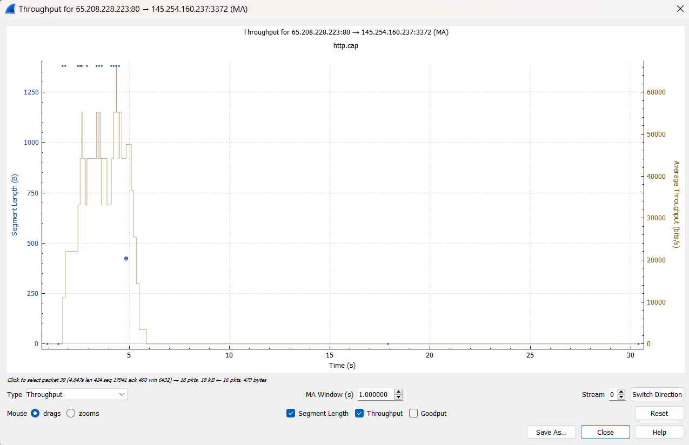
    
<strong>Gambar:</strong> Throughput

Throughput adalah ukuran kecepatan dan efisiensi pengiriman data melalui jaringan atau sistem komunikasi dalam suatu periode waktu. Ini diukur dalam satuan seperti bps, Kbps, Mbps, atau Gbps, dan mencerminkan jumlah data yang dapat dikirim atau diterima dalam waktu tertentu. Semakin tinggi throughput, semakin banyak data yang bisa diakomodasi dalam jaringan dalam waktu yang sama.

Sebagai contoh, Ketika hover salah satu packet, kita bisa melihat informasi seperti:

    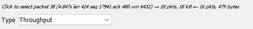
    
<strong>Gambar:</strong> Detail Throughput

> **1. Packet: 38**   > **2. Time: 4.875s**  > **3. Length: 424**  > **4. Sequence Number : 17941**  > **5. Acknowledgement Number : 480**  > **6. Win : 6432**

## Tugas 4. Analisis http_with_jpegs.cap

Mencari flag beberapa gambar (JPEG) yang terdapat pada file http_witp_jpegs.cap

### 1. Buka file http_witp_jpegs.cap

    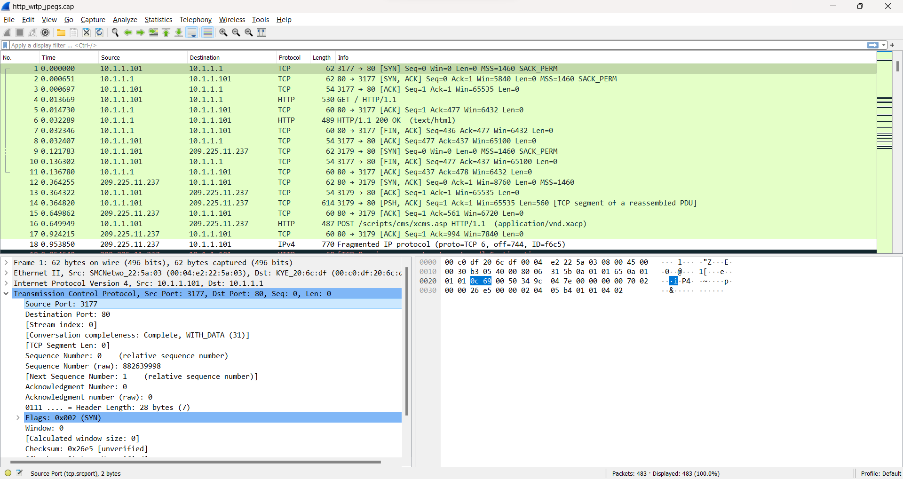
    
<strong>Gambar:</strong> Tampilan awal

### 2. Filter dengan menggunakan ctrl+f, kemudian cari HTTP. Maka akan tampil semua list dengan protocol http.

    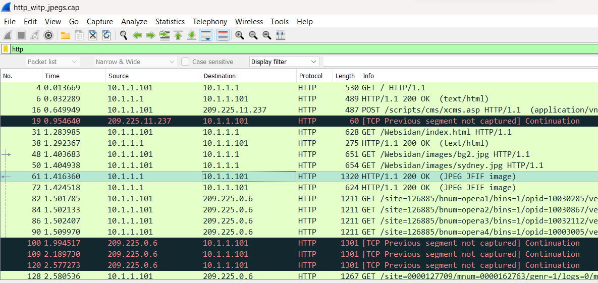
    
<strong>Gambar:</strong> Fileter HTTP

### 3. Cari semua packet dengan Info 200 OK (JPEG JFIF image)

    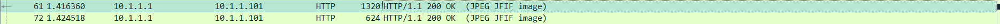
    
<strong>Gambar:</strong> JPEG JFIF image

    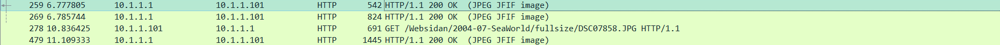
    
<strong>Gambar:</strong> JPEG JFIF image

### 4. Kemudian klik kanan pada bagian JPEG File Interchange Format, lalu pilih Show Packet Bytes... .Lakukan pada masing-masing packet dengan Info 200 OK (JPEG JFIF image).

    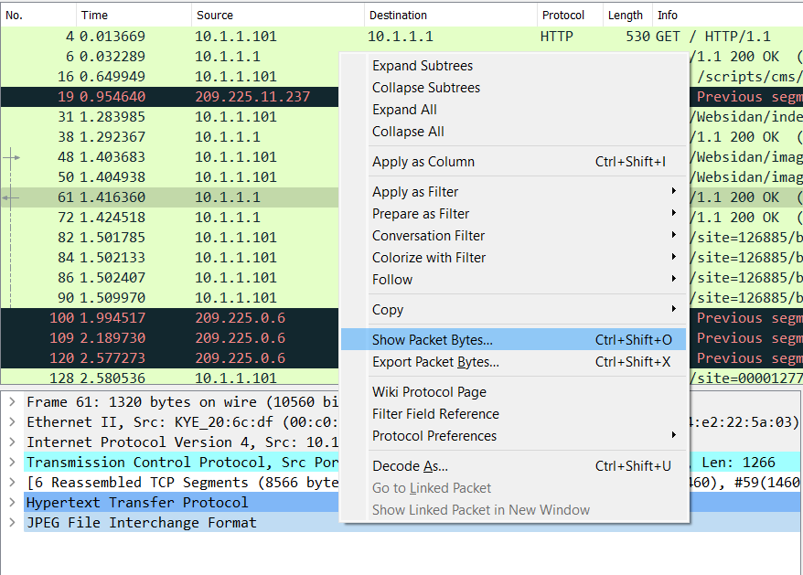
    
<strong>Gambar:</strong> Show packet bytes

### 5. Tampilan flag gambar yang dicari pada packet, terdapat 5 gambar sebagai berikut:

    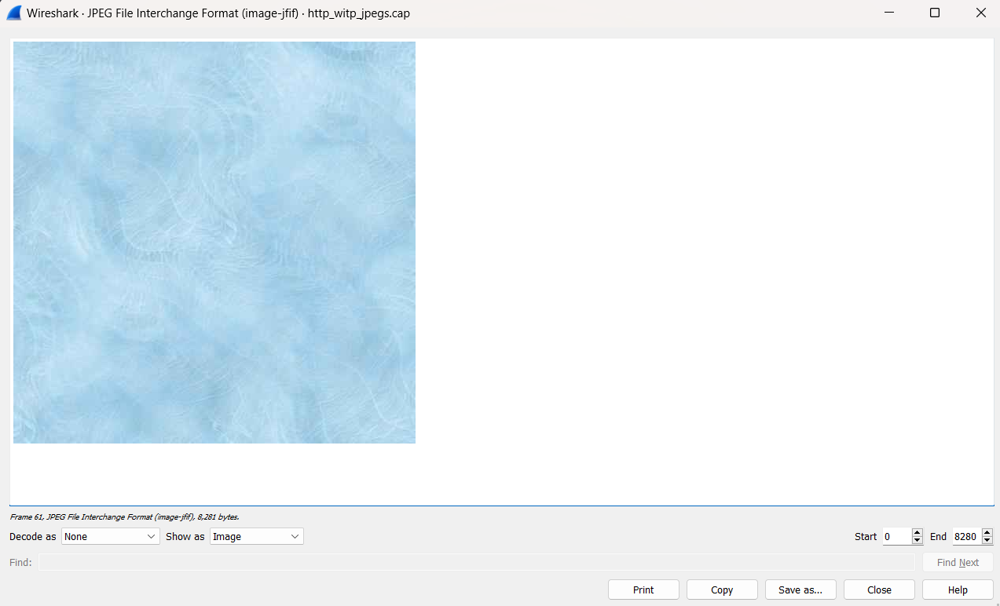
    
<strong>Gambar:</strong> Gambar 1

 

    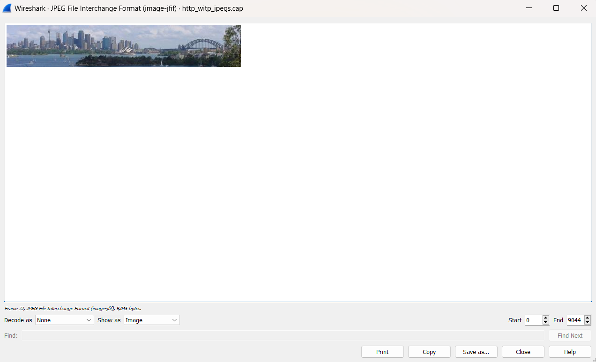
    
<strong>Gambar:</strong> Gambar 2

 

    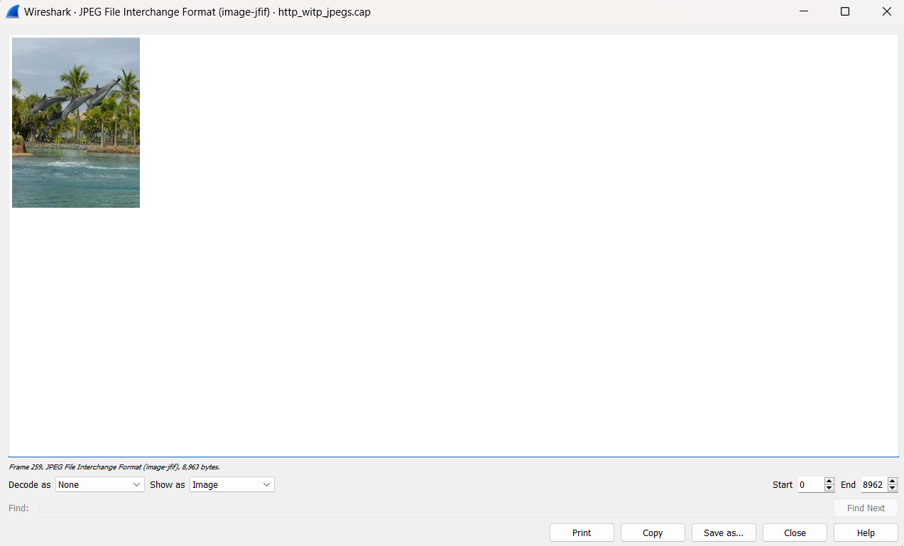
    
<strong>Gambar:</strong> Gambar 3

 

    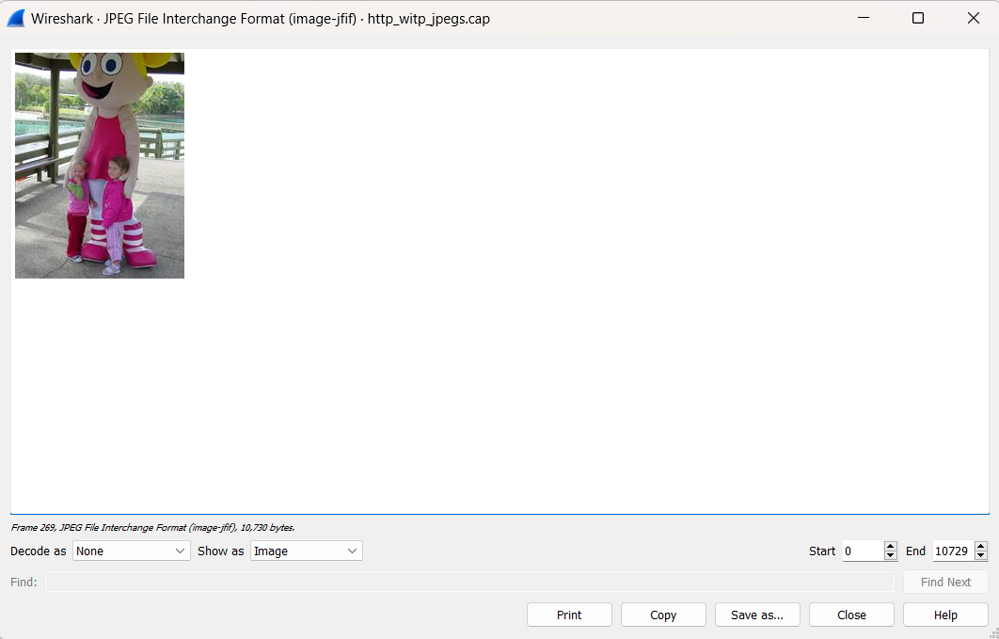
    
<strong>Gambar:</strong> Gambar 4

 

    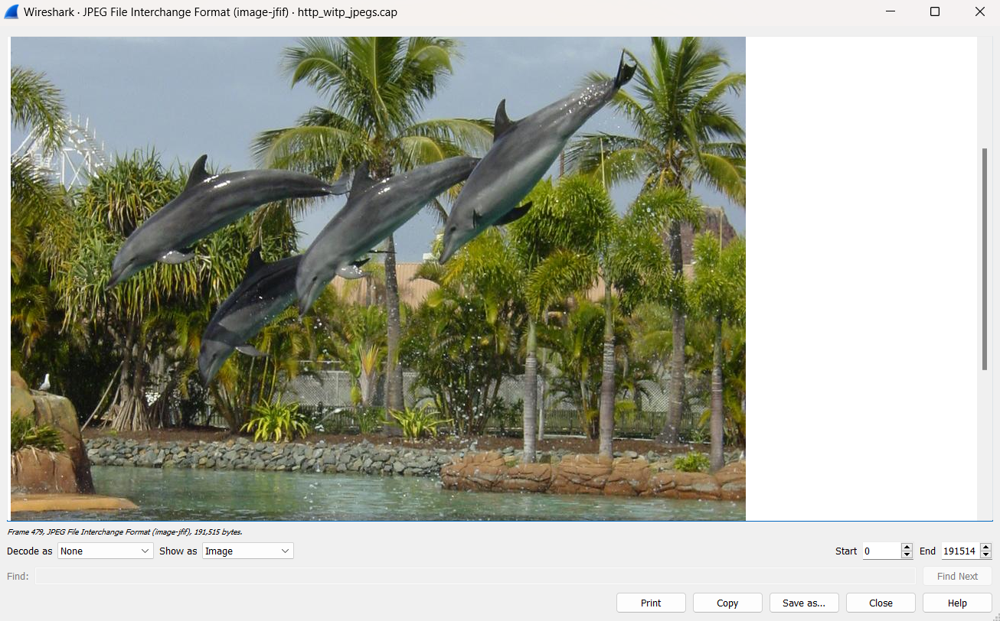
    
<strong>Gambar:</strong> Gambar 5

