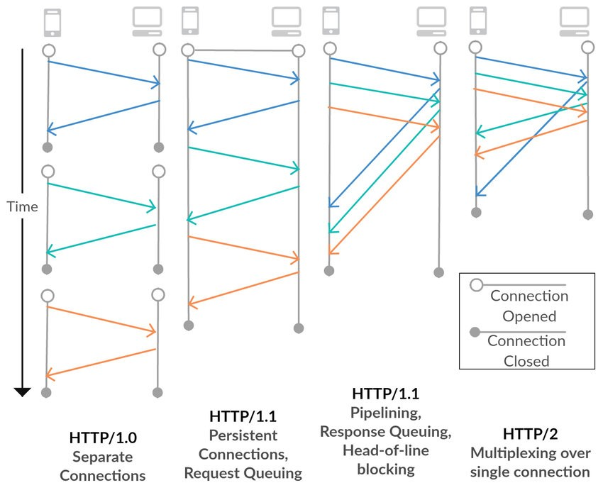
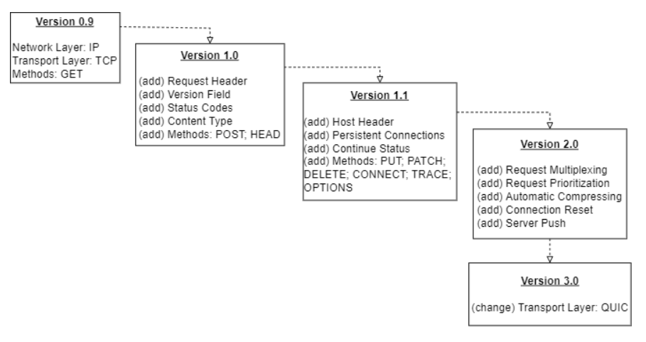
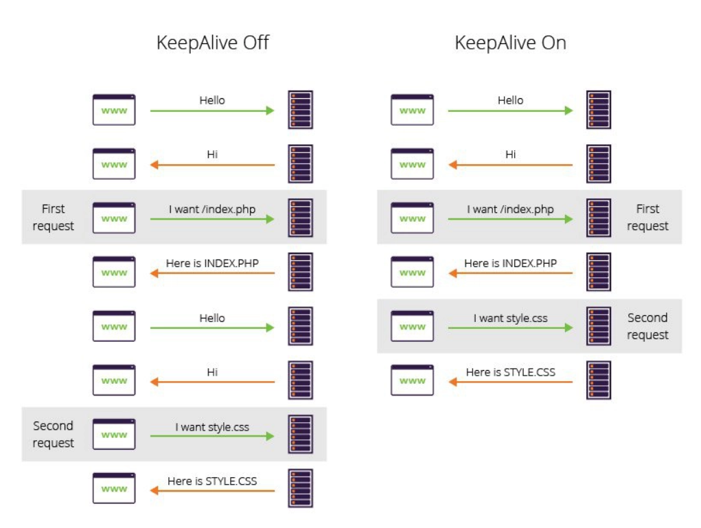

# EVOLUTION OF HTTP

    Nama		: Moch. Irham Kafi Billah
    NRP		: 3122600009
    Kelas		: 2 D4 Teknik Informatika
    Mata Kuliah	: Konsep Jaringan
    Dosen Pengampu	: Dr. Ferry Astika Saputra ST, M.Sc

#

**HTTP (Hypertext Transfer Protocol)** merupakan istilah yang diberikan pada sebuah protokol dan dipergunakan untuk mengirimkan dokumen dari WWW (World Wide Web).

HTTP berfungsi sebagai protokol permintaan-respons dalam model komputasi klien-server. Klien mengirimkan pesan permintaan HTTP ke server. Server yang menyediakan sumber daya seperti file HTML dan konten lainnya atau mengembalikan pesan respons ke klien. Respons tersebut berisi informasi status penyelesaian tentang permintaan dan mungkin juga berisi konten yang diminta di badan pesannya.

    
    
<strong>Gambar:</strong> Evolution of HTTP

**Berikut perkembangan http dari awal dibuat sampai saat ini:**

### 1. HTTP 0.9

- HTTP 0.9 adalah versi awal HTTP yang sangat sederhana.
- Hanya mendukung metode GET. - Permintaan HTTP hanya terdiri dari kata kunci "GET", alamat, dan versi protoko
- Contoh Permintaan HTTP 0.9: `GET /index.html`
- Tidak ada header HTTP (tidak dapat mentransfer file jenis konten lainnya), Tidak ada kode status/kesalahan, Tidak ada URL, Tidak ada versi.
- Sifat koneksi: dihentikan segera setelah respons

### 2. HTTP 1.0

- HTTP 1.0 memperkenalkan fitur-fitur seperti header permintaan HTTP, serta dukungan untuk koneksi persisten (Keep-Alive).
- Header "Host" diperkenalkan, memungkinkan server untuk mendukung beberapa domain pada satu alamat IP.
- Respons: tidak terbatas pada hypertext ( Content-Typeheader menyediakan kemampuan untuk mengirimkan file selain file HTML biasa — misalnya skrip, stylesheet, media)
- Contoh Permintaan HTTP 1.0: `GET /index.html HTTP/1.0 Host: www.contoh.com`
- Metode yang didukung: GET, HEAD,POST
- Sifat koneksi: dihentikan segera setelah respons

### 3. HTTP 1.1

- Ini adalah versi HTTP yang umum digunakan saat ini.
- Memperkenalkan optimalisasi kinerja penting dan peningkatan fitur — koneksi persisten dan pipeline, respons lebih cepat, dan penghematan bandwidth besar dengan menambahkan dukungan cache.
- Metode yang didukung: GET, HEAD, POST, PUT, DELETE, TRACE,OPTIONS
- Sifat koneksi: long-lived

### 4. HTTP 2.0

- HTTP/2.0 adalah versi terbaru yang menghadirkan transformasi besar.
- Menggunakan multiplexing untuk mengirim banyak permintaan/respons melalui satu koneksi.
- Memiliki kompresi header untuk mengurangi beban bandwidth. Prioritisasi permintaan untuk mengoptimalkan pengiriman.
- Contoh Permintaan HTTP/2.0: `GET /index.html Host: www.contoh.com`

### 5. HTTP 3.0

- TTP 3.0 merupakan Internet-Draft, berbeda dengan versi HTTP sebelumnya yang merupakan dokumen Request For Comments (RFC) dari Internet Engineering Task Force (IETF).
- Perbedaan utama antara HTTP 2.0 dan HTTP 3.0 adalah protokol lapisan transport yang digunakan.
- HTTP 3.0 dirancang melalui QUIC (Quick UDP Internet Connections).
- QUIC adalah protokol lapisan transport dengan multiplexing asli dan enkripsi bawaan. QUIC memberikan proses handshake yang cepat, selain mampu memitigasi masalah latensi pada koneksi yang lossy dan lambat.

    
    
<strong>Gambar:</strong> Rangkuman Perkembangan HTTP

#

## TCP Keep Alive dalam HTTP

HTTP keep alive adalah instruksi yang memungkinkan satu koneksi TCP tetap terbuka untuk beberapa permintaan/respons HTTP.

    
    
<strong>Gambar:</strong> Penggunaan KeepAlive

Secara default, koneksi HTTP ditutup setelah setiap permintaan. Ketika seseorang mengunjungi situs Anda, browser mereka perlu membuat koneksi baru untuk meminta setiap file yang membentuk halaman web Anda (misalnya gambar, Javascript, dan stylesheet CSS), sebuah proses yang dapat menyebabkan waktu muat halaman yang  tinggi.
  
Membangun koneksi TCP terlebih dahulu memerlukan jabat tangan tiga arah – pertukaran timbal balik paket SYN dan ACK antara klien dan server sebelum data dapat dikirim. Menggunakan header keep-alive berarti tidak harus terus-menerus melakukan proses ini. Hal ini mengakibatkan:

- Konservasi sumber daya jaringan : Menggunakan satu koneksi per klien akan mengurangi beban sumber daya jaringan.
- Mengurangi kemacetan jaringan : Mengurangi jumlah koneksi TCP antara server dan klien Anda dapat mengurangi kemacetan jaringan.
- Penurunan latensi : Mengurangi jumlah jabat tangan tiga arah dapat meningkatkan latensi situs. Hal ini terutama berlaku pada koneksi SSL/TLS , yang memerlukan perjalanan bolak-balik tambahan untuk mengenkripsi dan memverifikasi koneksi.
