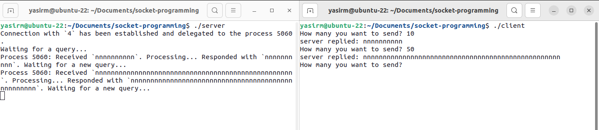
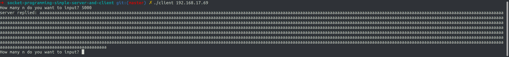
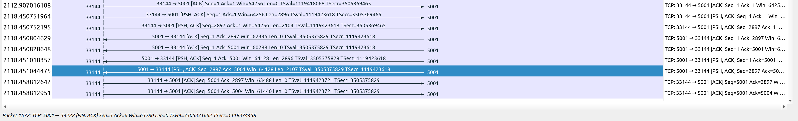

# EXPLANATION: SOCKET PROGRAMMING SIMPLE SERVER AND CLIENT

    Nama		: Moch. Irham Kafi Billah
    NRP		: 3122600009
    Kelas		: 2 D4 Teknik Informatika
    Mata Kuliah	: Konsep Jaringan
    Dosen Pengampu	: Dr. Ferry Astika Saputra ST, M.Sc

### 1. Server - `server.c`

#### Header

Kode dibawah ini mengimport berbagai header file standar dari C dan header terkait jaringan:

```c
#include <stdio.h>          // input/output dan alokasi memori
#include <stdlib.h>         // input/output dan alokasi memori
#include <netdb.h>          // jaringan untuk operasi socket
#include <netinet/in.h>     // jaringan untuk operasi socket
#include <string.h>         // manipulasi string
#include <unistd.h>         // layanan sistem operasi POSIX
#include <stdbool.h>        // tipe data boolean
#include <time.h>           // fungsi-fungsi terkait waktu
```

#### Fungsi `bzero`

Fungsi ini menempatkan n byte null ke dalam string s.

```c
void bzero(void *a, size_t n) {
    memset(a, 0, n);
}
```

#### Fungsi `bcopy`

Fungsi ini menyalin n byte-byte string s1 ke byte string s2.

```c
void bcopy(const void *src, void *dest, size_t n) {
    memmove(dest, src, n);
}
```

#### Fungsi `init_sockaddr_in`

Fungsi ini digunakan untuk menginisialisasi dan mengembalikan pointer ke struktur struct sockaddr_in. Struktur ini digunakan untuk mengonfigurasi alamat soket untuk berkomunikasi menggunakan protokol TCP/IP.

```c
struct sockaddr_in* init_sockaddr_in(uint16_t port_number) {
    struct sockaddr_in *socket_address = malloc(sizeof(struct sockaddr_in));
    memset(socket_address, 0, sizeof(*socket_address));
    socket_address -> sin_family = AF_INET;
    socket_address -> sin_addr.s_addr = htonl(INADDR_ANY);
    socket_address -> sin_port = htons(port_number);
    return socket_address;
}
```

#### Fungsi `process_operation`

Fungsi ini digunakan untuk mengelola operasi pada data input yang diterima sebagai string dan mengembalikan hasil operasi sebagai string baru.

```c
char* process_operation(char *input) {
    size_t n = strlen(input) * sizeof(char);
    char *output = malloc(n);
    memcpy(output, input, n);
    return output;
}
```

#### Fungsi `main`

```c
const uint16_t port_number = 5001;
int server_fd = socket(AF_INET, SOCK_STREAM, 0);

struct sockaddr_in *server_sockaddr = init_sockaddr_in(port_number);
struct sockaddr_in *client_sockaddr = malloc(sizeof(struct sockaddr_in));
socklen_t server_socklen = sizeof(*server_sockaddr);
socklen_t client_socklen = sizeof(*client_sockaddr);

if (bind(server_fd, (const struct sockaddr *) server_sockaddr, server_socklen) < 0)
{
    printf("Error! Bind has failed\n");
    exit(0);
}
if (listen(server_fd, 3) < 0)
{
    printf("Error! Can't listen\n");
    exit(0);
}
```

Kode di atas menginisialisasi variabel port_number dengan nilai 5001, yang merupakan nomor port yang akan digunakan oleh server.
Selanjutnya, program membuat socket server dengan menggunakan fungsi socket, mengkonfigurasi soket dengan keluarga alamat AF_INET dan jenis soket SOCK_STREAM untuk komunikasi TCP.
Struktur server_sockaddr diinisialisasi dengan alamat dan port yang sesuai menggunakan fungsi init_sockaddr_in. Ini adalah alamat server yang akan digunakan untuk mengikat soket.

Selain itu, dilakukan alokasi memori dinamis untuk struktur client_sockaddr, yang akan digunakan untuk menangani alamat klien saat ada koneksi masuk.Selanjutnya, program menggunakan bind untuk mengaitkan soket server dengan alamat yang telah diinisialisasi. Jika pengikatan gagal, program mencetak pesan kesalahan dan keluar. Kemudian, dengan listen, program menyiapkan soket server untuk mendengarkan koneksi masuk dengan antrian maksimum sebanyak 3. Jika gagal mendengarkan, pesan kesalahan dicetak dan program keluar.

```c
const size_t buffer_len = 256;
char *buffer = malloc(buffer_len * sizeof(char));
char *response = NULL;
time_t last_operation;
__pid_t pid = -1;
```

Bagian di atas menginisialisasi beberapa variabel, termasuk buffer yang akan digunakan untuk menampung data dari klien, response yang akan digunakan untuk menampung respons yang akan dikirimkan ke klien, dan variabel lainnya untuk manajemen waktu dan proses anak.

```c
while (1) {
    int client_fd = accept(server_fd, (struct sockaddr *) &client_sockaddr, &client_socklen);

    pid = fork();

    if (pid == 0) {
        close(server_fd);

        if (client_fd == -1) {
            exit(0);
        }

        // ...
    }
    else {
        close(client_fd);
    }
}
```

Di atas adalah bagian utama dari program, yang berupa loop tak terbatas. Di dalam loop ini, server akan terus menerima koneksi klien yang masuk.Setiap kali ada koneksi klien masuk, server akan menggunakan accept untuk menerima koneksi tersebut dan mendapatkan deskriptor file soket klien (client_fd).

Kemudian, program menggunakan fork untuk menciptakan proses anak yang akan menangani koneksi klien tersebut. Proses anak akan menutup soket server (server_fd) karena hanya akan menangani koneksi klien.Jika fork mengembalikan nilai 0, itu berarti kita berada dalam proses anak, dan proses tersebut akan mengeksekusi perintah-perintah yang terdapat di dalam blok if (pid == 0).Jika fork mengembalikan nilai selain 0, itu berarti kita berada dalam proses induk, dan proses tersebut akan menutup soket klien (client_fd) dan melanjutkan loop untuk menerima koneksi klien berikutnya.

```c
if (buffer == "close") {
    printf("Process %d: ", getpid());
    close(client_fd);
    printf("Closing session with `%d`. Bye!\n", client_fd);
    break;
}
```

Di dalam proses anak, program membaca data dari klien ke dalam buffer menggunakan read.Program kemudian memeriksa apakah data yang diterima adalah string "close". Jika demikian, maka proses anak akan menutup koneksi klien (client_fd), mencetak pesan penutupan sesi, dan keluar dari loop.

```c
if (strlen(buffer) == 0) {
    clock_t d = clock() - last_operation;
    double dif = 1.0 * d / CLOCKS_PER_SEC;

    if (dif > 5.0) {
        printf("Process %d: ", getpid());
        close(client_fd);
        printf("Connection timed out after %.3lf seconds. ", dif);
        printf("Closing session with `%d`. Bye!\n", client_fd);
        break;
    }

    continue;
}
```

Jika data yang diterima tidak kosong, maka program akan memeriksa apakah telah terjadi timeout. Jika tidak ada data yang diterima dalam waktu lebih dari 5 detik (sesuai dengan pengukuran waktu), maka koneksi akan dianggap timeout, dan proses anak akan menutup koneksi klien dan keluar dari loop.

```c
printf("Process %d: Received `%s`. Processing... ", getpid(), buffer);

free(response);
response = process_operation(buffer);
bzero(buffer, buffer_len * sizeof(char));

send(client_fd, response, strlen(response), 0);
printf("Responded with `%s`. Waiting for a new query...\n", response);

last_operation = clock();
```

Jika tidak ada kondisi khusus yang memaksa keluar dari loop, maka program akan memproses permintaan dari klien. Pertama, program mencetak pesan yang menunjukkan menerima data dari klien dan memulai proses pengolahan.

Program kemudian mengalokasikan memori untuk response (respons yang akan dikirimkan ke klien) dan memproses data yang diterima dari klien menggunakan fungsi process_operation. Setelah pemrosesan selesai, program mengirimkan respons kembali ke klien menggunakan send, kemudian mencetak pesan yang menunjukkan respons telah dikirim dan siap menerima permintaan baru.

Terakhir, program memperbarui waktu terakhir operasi dengan menggunakan clock(). Setelah proses anak menyelesaikan tugasnya, ia akan keluar dari proses dengan perintah exit(0), dan proses anak yang baru akan menerima koneksi klien berikutnya dalam loop.

Proses induk, di sisi lain, akan menutup soket klien (client_fd) karena komunikasi dengan klien akan ditangani oleh proses anak yang sesuai. Kemudian, proses induk akan kembali ke awal loop untuk menerima koneksi klien lainnya.

### 2. Client - `client.c`

Kode client berfungsi untuk terhubung ke server dengan alamat IP "127.0.0.1" pada port 5001, mengirimkan data, menerima respons dari server, dan keluar dari loop jika server mengirimkan pesan "quit".

```c
int sockfd, portno, n;
struct sockaddr_in serv_addr;
struct hostent *server;
char buffer[10000];
portno = 5001;
```

Di bagian di atas, variabel-variabel dan struktur yang akan digunakan dalam program diinisialisasi. Ini mencakup variabel sockfd untuk file descriptor soket, portno yang menyimpan nomor port yang akan digunakan, serv_addr untuk menyimpan alamat server, server untuk menyimpan informasi host server, dan buffer untuk menyimpan data yang akan dikirim dan diterima.

```c
sockfd = socket(AF_INET, SOCK_STREAM, 0);
server = gethostbyname("127.0.0.1");

if (server == NULL) {
    fprintf(stderr,"ERROR, no such host\n");
    exit(0);
}
```

Di sini, program membuat soket dengan menggunakan socket, mengatur keluarga alamat sebagai AF_INET dan jenis soket sebagai SOCK_STREAM untuk komunikasi TCP. Kemudian, program menggunakan gethostbyname untuk mengambil informasi host dengan alamat IP "127.0.0.1" (localhost). Jika host tidak ditemukan, program mencetak pesan kesalahan dan keluar.

```c
bzero((char *) &serv_addr, sizeof(serv_addr));
serv_addr.sin_family = AF_INET;
bcopy((char *)server->h_addr, (char *)&serv_addr.sin_addr.s_addr, server->h_length);
serv_addr.sin_port = htons(portno);
```

Selanjutnya, program mengatur struktur serv_addr dengan mengosongkan area memori terlebih dahulu menggunakan bzero. Kemudian, program mengatur keluarga alamat, alamat IP server, dan nomor port server ke dalam serv_addr.

```c
if (connect(sockfd, (struct sockaddr *)&serv_addr, sizeof(serv_addr)) < 0) {
    perror("ERROR while connecting");
    exit(1);
}
```

Di bagian ini, program mencoba untuk terhubung ke server menggunakan connect. Jika koneksi gagal, pesan kesalahan dicetak dan program keluar.

```c
while (1) {
    int n;
    printf("How many character you want to send? ");
    scanf("%d", &n);

    bzero(buffer,n);

    for(int i=0; i<n; i++){
        buffer[i] = 'a';
    }
    buffer[n] = '\0';

    n = write(sockfd,buffer,strlen(buffer));

    if (n < 0){
        perror("ERROR while writing to socket");
        exit(1);
    }

    bzero(buffer,256);
    n = read(sockfd, buffer, 255);

    if (n < 0){
        perror("ERROR while reading from socket");
        exit(1);
    }
    printf("server replied: %s \n", buffer);

    if (!bcmp(buffer, "quit", 4))
        break;
}
```

Ini adalah loop utama program, di mana program akan berinteraksi dengan server. Program pertama-tama meminta pengguna untuk memasukkan jumlah karakter yang akan dikirim ke server.

Kemudian, program mengisi buffer dengan karakter 'a' sebanyak yang diminta oleh pengguna. Data dalam buffer dikirim ke server menggunakan write, dan program menerima respons dari server menggunakan read.

Jika terjadi kesalahan dalam penulisan atau pembacaan data, pesan kesalahan dicetak, dan program keluar.Program mencetak respons dari server dan memeriksa apakah respons tersebut adalah "quit". Jika ya, program akan keluar dari loop utama, mengakhiri komunikasi dengan server.

## Percobaan 1

Percobaan 1, mengirim data sebanyak 10 dan 50 karakater.



## Percobaan 2

Percobaan 2, mengirim data sebanyak 5000 karakter.





Satu request dalam dua segmen TCP terjadi karena data yang ingin dikirimkan oleh pengirim (host sumber) melebihi ukuran maksimum yang dapat diakomodasi dalam satu segmen TCP atau Maximum Segment Size (MSS). Segmen TCP adalah unit data dalam protokol TCP, dan ukurannya terbatas oleh beberapa faktor, termasuk Maximum Segment Size yang ditentukan selama penegosiasian koneksi TCP dan ukuran jendela (window size) yang tersedia di kedua ujung koneksi.

Berikut adalah beberapa alasan mengapa request dapat dibagi menjadi dua segmen TCP:

1. **MSS Terbatas:** Maximum Segment Size (MSS) adalah ukuran maksimum data yang dapat dikirim dalam satu segmen TCP. Nilai MSS ini dapat bervariasi tergantung pada implementasi dan konfigurasi TCP. Jika ukuran data yang ingin dikirim melebihi nilai MSS, maka data harus dibagi menjadi beberapa segmen yang lebih kecil.
2. **Penggunaan PSH:** PSH (Push) adalah salah satu flag dalam header TCP yang mengindikasikan bahwa data perlu segera disampaikan ke aplikasi penerima. Jika aplikasi pengirim menetapkan flag PSH, maka segmen akan dikirim secepat mungkin. Ini bisa menyebabkan pengiriman lebih cepat dari segmen pertama yang berisi data yang telah di-push, dan segmen kedua untuk data tambahan.
3. **Optimasi dan Pengiriman Efisien:** Terkadang, pembagian data menjadi segmen yang lebih kecil dapat memungkinkan pengiriman yang lebih efisien. Segmen yang lebih kecil dapat meminimalkan overhead dalam jaringan dan memungkinkan pengiriman data secepat mungkin jika ada kebutuhan mendesak untuk menerima data oleh penerima.
4. **Ukuran Jendela (Window Size):** Ukuran jendela (window size) TCP diatur oleh kedua ujung koneksi. Jika ukuran jendela kecil, maka penerima akan memberi tahu pengirim untuk mengurangi laju pengiriman data. Dalam situasi ini, pengirim dapat membagi data menjadi segmen yang lebih kecil agar sesuai dengan ukuran jendela yang tersedia.

Dalam kasus ini, request TCP dibagi menjadi dua segmen karena beberapa faktor di atas yang mengharuskan pembagian data menjadi lebih kecil agar sesuai dengan batasan-batasan yang ada dalam protokol TCP dan konfigurasi jaringan.
