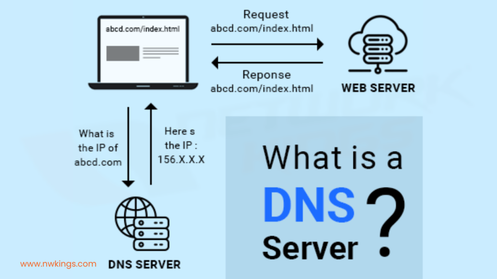
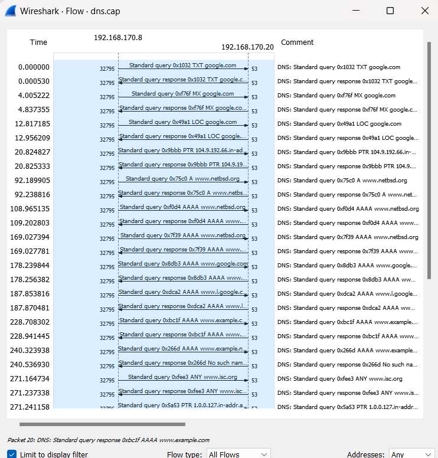

# Domain Name System (DNS)

    Nama		: Moch. Irham Kafi Billah
    NRP		: 3122600009
    Kelas		: 2 D4 Teknik Informatika
    Mata Kuliah	: Konsep Jaringan
    Dosen Pengampu	: Dr. Ferry Astika Saputra ST, M.Sc

    

DNS, atau Domain Name System, adalah sistem yang digunakan untuk menghubungkan nama domain (seperti www.example.com) ke alamat IP (Internet Protocol) yang sesuai (seperti 192.168.1.1). Ini adalah bagian penting dari infrastruktur internet yang memungkinkan kita untuk mengakses situs web, mengirim email, dan melakukan berbagai aktivitas online dengan menggunakan nama domain yang mudah diingat daripada harus menghafal alamat IP yang panjang dan rumit.

Struktur DNS terdiri dari hierarki domain yang memiliki level yang berbeda-beda. Level tertinggi adalah domain akar (root domain), diikuti oleh domain TLD (Top-Level Domain), domain tingkat kedua, dan seterusnya. Contohnya, dalam www.example.com, "com" adalah TLD, "example" adalah domain tingkat kedua, dan "www" adalah subdomain.

## Cara Kerja

Cara kerja DNS (Domain Name System) adalah proses yang rumit dan terdiri dari beberapa tahapan. Ini adalah sistem yang digunakan untuk menerjemahkan nama domain yang mudah diingat menjadi alamat IP yang sesuai. Berikut adalah langkah-langkah utama dalam cara kerja DNS:

1. **Permintaan Resolusi DNS:** Ketika Anda memasukkan URL (Uniform Resource Locator) ke dalam browser web Anda atau menjalankan operasi jaringan yang melibatkan nama domain (seperti mengirim email), komputer Anda akan membuat permintaan resolusi DNS. Permintaan ini berisi nama domain yang ingin diresolusi, misalnya "www.example.com".

2. **Cache DNS Lokal:** Pertama, komputer Anda akan memeriksa cache DNS lokalnya. Cache ini adalah tempat penyimpanan sementara di mana komputer Anda dapat menyimpan rekaman DNS yang baru saja diakses. Jika rekaman DNS untuk nama domain yang Anda cari ada dalam cache dan masih valid (dalam periode TTL - Time to Live), maka permintaan resolusi akan selesai tanpa perlu menghubungi server DNS eksternal.
3. **Server DNS Lokal:** Jika rekaman DNS tidak ditemukan dalam cache lokal atau sudah kadaluwarsa, komputer Anda akan mengirimkan permintaan ke server DNS lokal yang dikonfigurasi dalam pengaturan jaringan Anda. Server DNS lokal ini biasanya disediakan oleh penyedia layanan internet (ISP) Anda.
4. **Server DNS Recursive:** Jika server DNS lokal juga tidak memiliki rekaman DNS yang sesuai dalam cache atau dalam basis data otoritatif, maka server DNS lokal akan bertindak sebagai server DNS rekursif. Ini berarti server akan melakukan pencarian DNS yang lengkap untuk menemukan alamat IP yang sesuai.
5. **Mengunjungi Server DNS Root:** Server DNS rekursif pertama-tama akan mengunjungi server DNS root. Server DNS root adalah bagian paling atas dari hierarki DNS dan memiliki informasi tentang lokasi server DNS TLD (Top-Level Domain). Permintaan dari server DNS rekursif berisi informasi tentang nama domain yang dicari.
6. **Server DNS TLD:** Server DNS root akan merespons dengan mengarahkan permintaan ke server DNS TLD yang sesuai dengan TLD (Top-Level Domain) dalam nama domain yang dicari. Misalnya, jika nama domain adalah "www.example.com," maka server DNS TLD yang mengelola domain ".com" akan dihubungi.
7. **Server DNS Otoritatif:** Server DNS TLD akan memberikan informasi tentang server DNS otoritatif yang mengelola domain "example.com." Kemudian, server DNS rekursif akan menghubungi server DNS otoritatif ini.
8. **Resolusi DNS Akhir:** Server DNS otoritatif akan mengirimkan jawaban resolusi DNS akhir ke server DNS rekursif. Jawaban ini akan berisi alamat IP yang sesuai dengan nama domain yang dicari.
9. **Penyampaian Hasil Resolusi:** Server DNS rekursif akan menyampaikan hasil resolusi DNS kepada komputer Anda. Komputer Anda akan menyimpan informasi ini dalam cache DNS lokalnya untuk penggunaan berikutnya.
10. **Akses ke Situs Web atau Layanan:** Setelah komputer Anda memiliki alamat IP yang sesuai, permintaan Anda akan diarahkan ke server web yang sesuai dengan nama domain, dan situs web atau layanan yang Anda tuju akan diakses.

## Flow Graph

    

1. **Permintaan DNS (UDP):** Pada tahap ini, komputer pengguna mengirimkan permintaan DNS (Domain Name System) menggunakan protokol UDP (User Datagram Protocol) ke server DNS. Permintaan ini berisi informasi tentang nama domain yang ingin diresolusi, seperti "www.example.com." Permintaan DNS ini adalah langkah pertama dalam mencari alamat IP yang sesuai dengan nama domain yang diminta.

2. **Respons DNS (UDP):** Setelah menerima permintaan DNS, server DNS mencari alamat IP yang sesuai dengan nama domain yang diminta. Setelah menemukannya, server DNS mengirimkan respons DNS menggunakan protokol UDP ke komputer pengguna. Respons ini berisi alamat IP yang sesuai dengan nama domain yang diminta. Tahap ini menandai akhir dari proses resolusi DNS untuk permintaan tersebut, dan komputer pengguna dapat menggunakan alamat IP ini untuk mengakses situs web atau layanan yang diinginkan.
