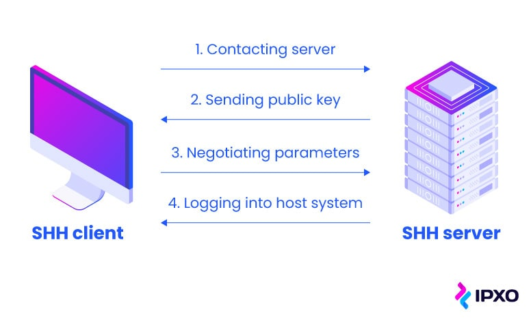

# Secure Shell (SSH)

    Nama		: Moch. Irham Kafi Billah
    NRP		: 3122600009
    Kelas		: 2 D4 Teknik Informatika
    Mata Kuliah	: Konsep Jaringan
    Dosen Pengampu	: Dr. Ferry Astika Saputra ST, M.Sc

    

## 1. PENGERTIAN

SSH adalah protokol keamanan yang digunakan untuk mengamankan komunikasi jaringan, terutama dalam konteks akses jarak jauh dan manajemen sistem komputer. Ini memungkinkan pengguna atau administrator sistem untuk melakukan berbagai tugas, seperti mengakses shell jarak jauh, mentransfer berkas, dan mengelola perangkat jarak jauh, dengan aman dan terenkripsi.

Salah satu alasan utama penciptaan SSH adalah bahwa Telnet tidak menyediakan enkripsi data yang dikirimkan antara klien dan server. Ini berarti bahwa jika seseorang memiliki akses ke jaringan yang sama, mereka dapat dengan mudah menangkap data sensitif, seperti nama pengguna dan kata sandi, yang dikirimkan melalui Telnet.

## 2. RFC

RFC (Request for Comments) yang menggambarkan protokol SSH adalah RFC 4251 hingga RFC 4254. RFC-nya mencakup berbagai aspek protokol, termasuk spesifikasi teknis dan detail implementasi.

## 3. VERSI

Terdapat dua versi utama dari protokol SSH:

- **SSH-1:** Adalah versi asli dari SSH dan dijelaskan dalam RFC 4251 hingga RFC 4254. Versi ini memiliki beberapa kerentanannya dan sebaiknya tidak digunakan lagi karena sudah tidak aman.
- **SSH-2:** Adalah versi yang lebih baru dan aman dari SSH, yang dijelaskan dalam RFC 4251 hingga RFC 4254. SSH-2 memiliki peningkatan keamanan dan dukungan yang lebih baik untuk berbagai fitur.

## 4. KARAKTERISTIK

Ssh memiliki beberapa karakteristik utama ssh meliputi:

1. **Keamanan:** Salah satu karakteristik paling utama dari SSH adalah keamanannya yang tinggi. Protokol ini menyediakan enkripsi end-to-end yang kuat untuk data yang dikirimkan antara klien dan server. Ini berarti bahwa bahkan jika data tersebut disadap selama transit, akan sangat sulit untuk membaca atau mengaksesnya tanpa kunci enkripsi yang tepat.

2. **Autentikasi:** SSH memungkinkan berbagai metode autentikasi, seperti kata sandi, kunci publik-privat, serta otentikasi berbasis sertifikat. Ini memungkinkan pengguna dan perangkat untuk diidentifikasi secara aman sebelum diizinkan mengakses sistem atau layanan yang tersedia melalui SSH.

3. **Koneksi Aman:** SSH juga mendukung tunnelling, yang memungkinkan lalu lintas jaringan lainnya (seperti HTTP atau FTP) untuk mengalir melalui koneksi SSH, menjadikannya lebih aman. Selain itu, SSH dapat digunakan untuk mengakses shell jarak jauh (remote shell) dan untuk mentransfer berkas secara aman (SFTP - Secure File Transfer Protocol).

4. **Port Standar:** Port standar yang digunakan oleh SSH adalah port 22. Namun, ini dapat dikonfigurasi untuk menggunakan port lain jika diperlukan untuk tujuan keamanan.
5. **Kompatibilitas Lintas Platform:** Salah satu keunggulan besar dari SSH adalah kompatibilitas lintas platformnya. Klien SSH tersedia untuk berbagai sistem operasi, seperti Windows, macOS, dan berbagai distribusi Linux. Ini memungkinkan administrator sistem untuk mengelola dan mengakses perangkat dari berbagai platform.

6. **Penggunaan Luas:** SSH digunakan secara luas dalam manajemen server, remote shell, transfer file aman, dan berbagai aplikasi lainnya di seluruh dunia. Ini adalah alat yang sangat penting untuk menjaga keamanan jaringan dan data di lingkungan komputasi modern.

7. **Penggunaan dalam Perangkat Jaringan:** SSH juga digunakan dalam banyak perangkat jaringan, seperti router dan switch, untuk memungkinkan administrasi jarak jauh yang aman.
