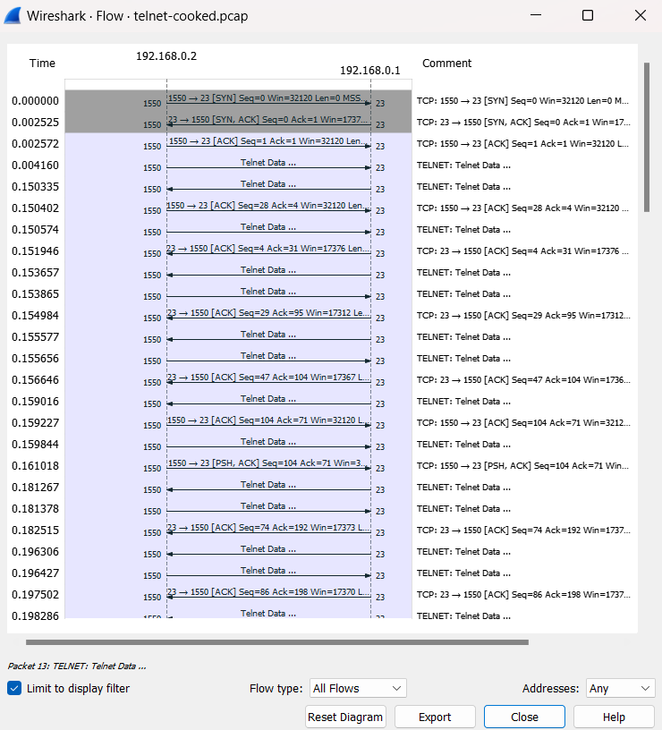

# Telnet

    Nama		: Moch. Irham Kafi Billah
    NRP		: 3122600009
    Kelas		: 2 D4 Teknik Informatika
    Mata Kuliah	: Konsep Jaringan
    Dosen Pengampu	: Dr. Ferry Astika Saputra ST, M.Sc

## 1. PENGERTIAN

Telnet adalah sebuah protokol jaringan yang digunakan untuk mengakses dan mengendalikan perangkat jarak jauh melalui jaringan komputer. Protokol ini memungkinkan pengguna untuk melakukan akses jarak jauh ke perangkat seperti server, router, atau komputer lainnya, seolah-olah mereka sedang duduk di depan perangkat tersebut secara fisik. Telnet menggunakan koneksi TCP/IP (Transmission Control Protocol/Internet Protocol) untuk mentransmisikan data antara komputer pengguna (client) dan komputer tujuan (server) melalui jaringan.

# 2. RFC

Telnet didokumentasikan dalam beberapa RFC. RFC adalah serangkaian dokumen yang digunakan untuk menggambarkan protokol dan standar di internet. Telnet awalnya dijelaskan dalam RFC 854, yang kemudian diperbarui oleh RFC 855, RFC 856, dan RFC 857. RFC terbaru yang terkait dengan Telnet adalah RFC 854, yang diterbitkan pada tahun 1983. Namun, penggunaan Telnet telah menurun seiring waktu karena kurangnya keamanan, dan protokol pengganti yang lebih aman seperti SSH telah menjadi lebih populer.

## 3. TCP FLOW GRAPH

Telnet adalah protokol jaringan yang berbasis TCP (Transmission Control Protocol), sehingga alur atau "flow" dari koneksi Telnet mengikuti model dasar yang sama dengan alur koneksi TCP pada umumnya. Di bawah ini, saya akan menjelaskan bagaimana alur koneksi Telnet TCP berlangsung dalam bentuk grafik alur:

    

1. Pengguna memulai koneksi Telnet dengan mengirimkan permintaan koneksi (SYN) ke server Telnet.
2. Klien Telnet mengirimkan data ke server, seperti permintaan autentikasi (nama pengguna dan kata sandi).
3. Server Telnet menerima data dan memprosesnya, kemungkinan dengan meminta pengguna untuk memasukkan informasi autentikasi.
4. Server Telnet membalas dengan mengirimkan data balasan.
5. Klien Telnet menerima data balasan dari server.
6. Klien Telnet mengirimkan lebih banyak data atau perintah ke server (interaksi berlanjut).
7. Server Telnet menerima perintah dari klien dan merespons dengan mengirimkan data lebih lanjut.
8. Pengguna mengirimkan permintaan untuk menutup koneksi (FIN) ke server setelah selesai.
9. Server Telnet merespons dengan mengirimkan konfirmasi penutupan koneksi (FIN), dan koneksi ditutup.
