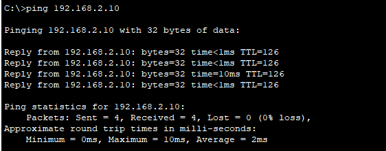

# Praktikum | Minggu-7

    Nama		: Moch. Irham Kafi Billah
    NRP		: 3122600009
    Kelas		: 2 D4 Teknik Informatika
    Mata Kuliah	: Konsep Jaringan
    Dosen Pengampu	: Dr. Ferry Astika Saputra ST, M.Sc

Pada praktikum kali ini, kita akan mengirim ping antar komputer dalam sebuah topologi komputer yang dibuat menggunakan Cisco Packet Tracer.
Dalam konteks ini, kita akan menjelajahi implementasi konkret dari topologi yang melibatkan dua router, dua switch, dan empat komputer (PC).

    
    
<strong>Gambar:</strong> Packet Tracer

## Keterangan tiap komponen

**Router:** Setiap router memiliki dua antarmuka yang menghubungkan jaringan yang berbeda. Penjelasan :

Router 1:

- Antarmuka 0/0:
  - IP Address: 192.168.1.1
  - Subnet Mask: 255.255.255.0
- Antarmuka 0/1:
  - IP Address: 10.0.1.1
  - Subnet Mask: 255.255.255.0

Router 2:

- Antarmuka 0/0:
  - IP Address: 192.168.2.1
  - Subnet Mask: 255.255.255.0
- Antarmuka 0/1:
  - IP Address: 10.0.1.2
  - Subnet Mask: 255.255.255.0

**Switch:** Setiap switch menghubungkan dua PC dalam jaringan yang sama. Penjelasan:

Switch 1:

- PC1:
  - IP Address: 192.168.1.10
  - Subnet Mask: 255.255.255.0
- PC2:
  - IP Address: 192.168.1.20
  - Subnet Mask: 255.255.255.0

Switch 2:

- PC3:
  - IP Address: 192.168.2.10
  - Subnet Mask: 255.255.255.0
- PC4:
  - IP Address: 192.168.2.20
  - Subnet Mask: 255.255.255.0

## Hasil Tes ping

- **pc 1 ke pc 2**  
  

- **pc 1 ke pc 3**  
  

- **pc 1 ke pc 4**  
  
