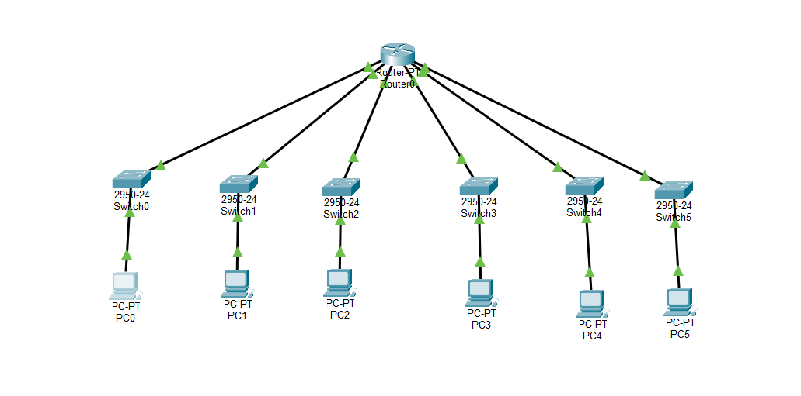
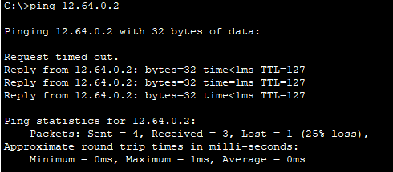
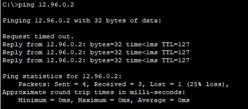
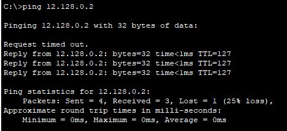
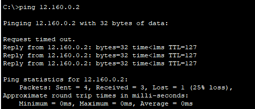
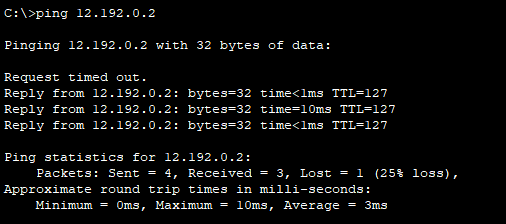

# Networok Configuration | 6 Subnet

    Nama		: Moch. Irham Kafi Billah
    NRP		: 3122600009
    Kelas		: 2 D4 Teknik Informatika
    Mata Kuliah	: Konsep Jaringan
    Dosen Pengampu	: Dr. Ferry Astika Saputra ST, M.Sc

Pada praktikum kali ini, kita akan menggunakan 1 Route, 6 Switch dan 6 PC pada alamat IP publik 12.0.0.0/8.

    
    
<strong>Gambar:</strong> Packet Tracer

## Keterangan Konfigurasinya

**Router:**

- FastEthernet(Fa) 0/0 : 12.32.0.1
- FastEthernet(Fa) 1/0 : 12.64.0.1
- FastEthernet(Fa) 6/0 : 12.96.0.1
- FastEthernet(Fa) 7/0 : 12.128.0.1
- FastEthernet(Fa) 8/0 : 12.160.0.1
- FastEthernet(Fa) 9/0 : 12.192.0.1

**PC:**

- PC0:
  - IP Address: 12.32.0.2
  - Subnet Mask: 255.224.0.0
  - Gateway: 12.32.0.1
- PC1:
  - IP Address: 12.64.0.2
  - Subnet Mask: 255.224.0.0
  - Gateway: 12.64.0.1
- PC2:
  - IP Address: 12.96.0.2
  - Subnet Mask: 255.224.0.0
  - Gateway: 12.96.0.1
- PC3:
  - IP Address: 12.128.0.2
  - Subnet Mask: 255.224.0.0
  - Gateway 12.128.0.1
- PC4:
  - IP Address: 12.160.0.2
  - Subnet Mask: 255.224.0.0
  - Gateway 12.160.0.1
- PC5:
  - IP Address: 12.196.0.2
  - Subnet Mask: 255.224.0.0
  - Gateway 12.196.0.1

## Hasil tes ping

- **PC 0 ke PC 1**  
  

- **PC 0 ke PC 2**  
  

- **PC 0 ke PC 3**  
  

- **PC 0 ke PC 4**  
  

- **PC 0 ke PC 5**  
  
